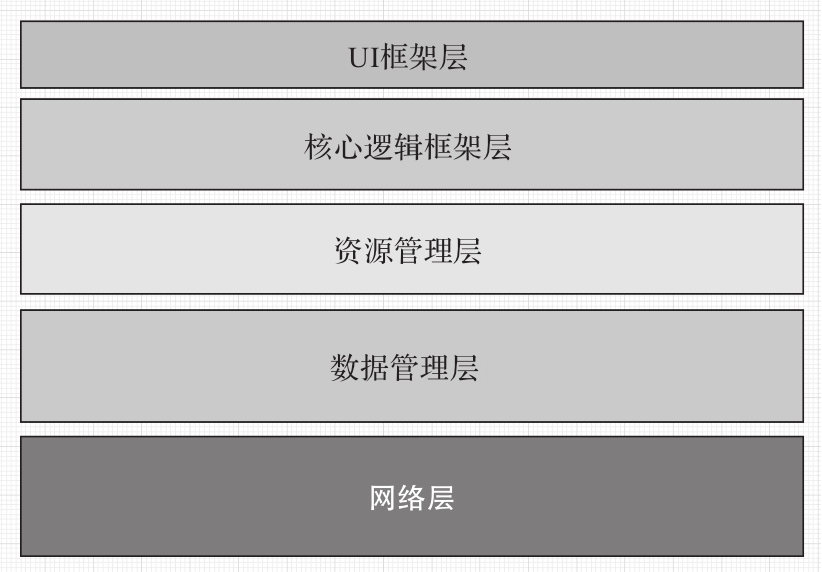
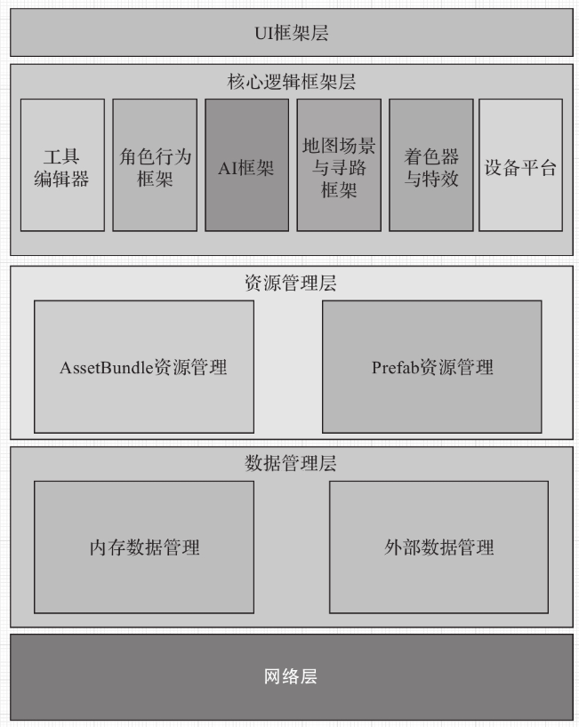
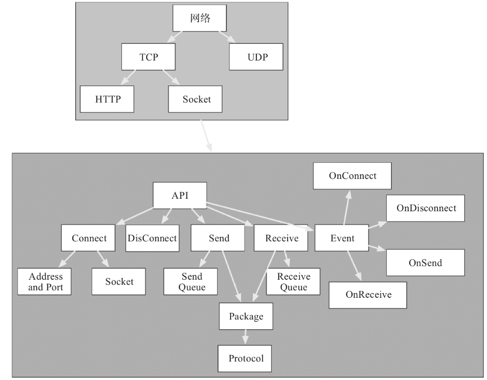

# Unity3D 高级编程：主程手记

## 软件架构

### 架构的好坏

架构的好坏可从以下几个方面进行评估：

* **承载力**：一个架构能承载多少个逻辑系统，程序员彼此工作的模块耦合度是否依然能保持原来的设计要求，能够承载多少个程序员共同开发，共同开发的效率又如何。对于服务器来说，当前架构能承受多少人同时访问，能承载的日均访问量是多少。对于客户端来说，能显示多少UI元素，可渲染多少模型（包括同屏渲染和非同屏渲染）。
* **可扩展性**：架构能适应不同类型的需求，可添加不同类型的系统、不同功能的子系统。可扩展性的关键在于，是否能在添加新的子系统后不影响或者尽可能少影响其他子系统的运作。
* **易用性**：易用性决定了架构的整体开发效率，程序员容易上手，子系统容易对接，开发效率自然就高。精力和注意力都可以集中在子系统的设计和编码上，这才能让各系统各尽其职，将效率发挥到极致。
* **可伸缩性**：从客户端的角度，伸缩力体现在是否既能适应大型项目上，如上百人协同开发一个复杂系统，也能适应小项目上，如1～3人小团队的快速开发环境，即小成本小作品的快速迭代。
* **容错性以及错误的感知力**：从客户端角度，容错性包括当程序发生错误时，是否同样能够继续保持运行而不崩溃；当这个页面程序出错时，是否依然能够运行其他程序而不闪退或崩溃。同时所有出现的程序错误，都能及时地记录下来并发送到后台，存储为错误日志，便于开发人员及时得到详细的错误信息，能够根据错误信息快速找出问题所在。

### 架构中的思维方式

架构设计中最重要的能力是什么，我会毫不犹豫回答是抽象能力。

* **分层思维**：构建一套复杂系统时，我们把整个系统划分成若干个层次，每一层专注解决某个领域的问题，并向上提供服务。这样的抽象做法，让复杂的事务变得更加清晰、有序。
* **分治思维**：对于一个无法一次解决的大问题，我们先把大问题分解成若干个子问题，如果子问题还无法解决，则继续分解成子子问题，直到可以直接解决为止，这就是分解(divide)的过程；然后将子子问题的解组合成子问题的解，再将子问题的解组合成原问题的解，这就是组合(combine)的过程。
* **演化思维**：在软件系统的整个生命周期中，前期的设计和开发大致占三分，在后面的七分时间里，架构师需要根据用户的反馈对架构进行不断的调整。借助用户的反馈和进化的力量，推动架构的持续演进，这就是演化式架构思维。

### Unity3D 分层设计

> 架构分层

> 分层后再分治

> 网络层设计

不同游戏类型的需要的模块和层级不同。

* 在游戏项目中，最常用的是**数据表**、**网络层**、**UI层**、**常用库**这几个模块。
* 如果项目是单机的策略类游戏，可能就没有很多角色上的东西，而多了很多2D动画行为控制上的需求。这时在进行层级划分时，就可以把注意力重点放在**2D动画行为控制**、**UI框架**、**数据管理**、**资源管理**及**AI**上。
* 如果项目是以3D人物角色为主的网络游戏，则应有**地形地图**、**角色行为控制**等内容，此外，还需要一套**角色技能**、**特效**、**动画编辑工具**等。
* 网络游戏项目前期我们会对网络这块内容进行决策，确定是TCP-Socket、UDP还是Web形式的HTTP。
* 3D MMRPG的难度主要集中在了解角色**技能动画**、**AI**、**地图**、**物理模拟**上。

对各个模块进行分解拆分。

* **数据表**：EXL导为二进制文件、JSON或其他格式，读取接口和解析接口的定义。
* **UI层**：确定是使用NGUI还是UGUI，并针对界面基类、界面管理、输入事件封装进行选择，且自定义通用组件基类和各类通用组件。
* **外部资源管理**：确定是否使用AssetBundle，是否对AssetBundle资源进行分类，是否依赖AssetBundle资源间的关系，是否加载与释放AssetBundle的管理，是否加密AssetBundle。
* **AI层**：确定是使用状态机还是行为树或者其他，以及状态机或行为树接口的实现、AI可视化工具、AI扩展接口。
* **地形地图**：包括地图是2D的还是3D的，场景编辑器的结构是否需要网络合并，场景内的大小物件区别对待，大地形在游戏里如何显示，是否要划分区块。
* **寻路与网格**：确定是使用A星算法还是跳点算法或者其他算法；是使用网格栅格还是三角网格；是使用长距离寻路的解决方案还是地图数据管理。
* **常用库**：包括时间函数、数学函数、数字变量加密封装、坐标转换函数、Debug调试工具、各大逻辑系统通用工具等。
* **角色行为控制**：包括人物移动处理方案、摄像机的碰撞检测、动画特效编辑器、技能编辑器、行为流的建立。
* **2D动画控制**：包括动画组件封装、2D动画的制作流程、2D图合并为图集。

## C# 技术要点

Unity3D中 C# 的底层原理