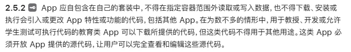
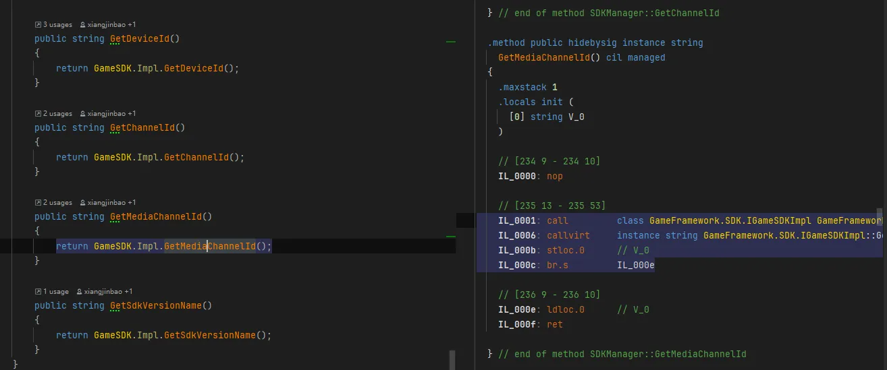

# HybridCLR

## 为什么使用 HybridCLR?

一切为了热更新。

**什么是热更新？为什么需要热更新？**

**热更新** 就是用户不需要去应用商店重新下载安装包，打开游戏即可自动下载补丁并完成更新。

为什么需要热更新？

* 应用商店审核周期长，使用热更新绕过审核
* 及时修复 BUG
* 缩减初始包体
* 内容迭代，活动运营

**IOS 上的热更新策略**

IOS 禁止 JIT，什么是 JIT？IOS 为什么禁止 JIT?

JIT(Just-In-Time) 允许程序在运行时把一段脚本动态编译成机器码并执行。

IOS 强制执行 W^X(Write XOR Execute)原则。一段内存要么是`可写`的(用来存数据)，要么是`可执行`的(用来存代码)，决不允许既可写又可执行。
 
[IOS App 审核指南](https://developer.apple.com/cn/app-store/review/guidelines/)



* 绝对禁止：运行时动态修改系统层行为(JSPatch)，使用反射动态调用私有 API。
* 默认允许：解释性代码，前提：不改变 APP 用途。

## 热更新方案有哪些？

Lua 系列：[xLua](https://github.com/Tencent/xLua) [tolua](https://github.com/topameng/tolua) [slua](https://github.com/pangweiwei/slua)

```
xLua 为 Unity、.Net、Mono 等 C# 环境增加 Lua 脚本编程的能力，借助 xLua，这些 Lua 代码可以方便的和 C# 相互调用。
```

JS/TS 系列：[Puerts](https://github.com/Tencent/puerts)

```
PuerTS is a TypeScript programming solution in Unity/Unreal/DotNet.
* provides a JavaScript Runtime.
* allows TypeScript to access the host engine with the help of TypeScript declarations generation.
```

C# 解释执行：[ILRuntime](https://github.com/Ourpalm/ILRuntime)

```
ILRuntime 项目为基于 C# 的平台(例如 Unity)提供了一个纯 C# 实现，快速、方便且可靠的 IL 运行时，使得能够在不支持 JIT 的硬件环境(如 iOS)能够实现代码的热更新
```

AOT+解释执行：[HybridCLR](https://www.hybridclr.cn/)

```
HybridCLR 是一个特性完整、零成本、高性能、低内存的近乎完美的 Unity 全平台原生 C# 热更新解决方案。

HybridCLR 扩充了 il2cpp 运行时代码，使它由纯 AOT runtime 变成 AOT + Interpreter 混合 runtime，进而原生支持动态加载 assembly，从底层彻底支持了热更新。使用 HybridCLR 技术的游戏不仅能在 Android 平台，也能在 IOS、Consoles、WebGL 等所有 il2cpp 支持的平台上高效运行。

由于 HybridCLR 对 ECMA-335 规范的良好支持以及对 Unity 开发工作流的高度兼容，Unity 项目在接入 HybridCLR 后，可以几乎无缝地获得 C# 代码热更新的能力，开发者不需要改变日常开发习惯和要求。HybridCLR 首次实现了将 Unity 平台的全平台代码热更新方案的工程难度降到几乎为零的水平。
```

## 热更新相关的几个概念

**IL/CIL(Common Intermediate Language，中间语言)**

当你编译 C# 代码时，它不会直接变成机器码，而是变成 IL(在 .NET 中也叫 MSIL 或 CIL)。它是一种通用的、跨平台的指令集。



**Interpret(解释执行)**

逐行读取代码(或 IL)，读一行，翻译一行，执行一行。不需要预编译，启动快，但运行速度慢(因为翻译占用了运行时间)。

**VM(Virtual Machine，虚拟机)**

它负责管理内存、安全和代码运行。IL 代码必须在 VM 中才能运行。

**CLR(Common Language Runtime，公共语言运行时)**

微软定义的 .NET 程序的虚拟机。它负责垃圾回收(GC)、异常处理和安全检查。Mono 是 CLR 的一种实现。

**Mono**

一个开源的 .NET 框架实现。

**AOT(Ahead-of-Time，预编译)**

在程序运行前(通常是打包时)，就将所有代码翻译成机器码。运行效率最高，启动快。iOS 强制要求使用 AOT 模式。

**JIT(Just-In-Time，即时编译)**

当程序运行时，VM 将 IL 代码按需编译成机器码。运行速度快，但因为 iOS 禁止在内存中生成可执行代码，所以 JIT 在 iOS 上无法工作。

**IL2CPP(Intermediate Language To C++)**

Unity 自研的技术。它将 C# 编译出的 IL 代码转换成 C++ 代码，然后再利用各平台(如 Xcode, Visual Studio)的 C++ 编译器将其编译成原生机器码。

* C++ 编译出的机器码效率极高。
* 解决了 iOS 禁止 JIT 的问题(通过 AOT 编译)。
* C++ 编译后的二进制文件比 IL 更难被反编译。

mono vs il2cpp
il2cpp vs net native aot