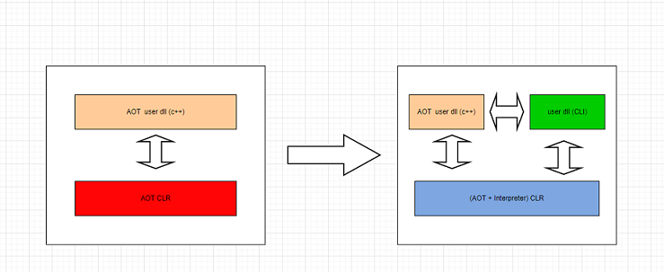

# HybridCLR

HybridCLR 是一个 Unity 全平台原生 C# 热更新解决方案。

HybridCLR 扩充了 il2cpp 运行时代码，使它由纯 AOT runtime 变成 AOT + Interpreter 混合 runtime，进而原生支持动态加载 assembly，从底层彻底支持了热更新。

* [官网](https://www.hybridclr.cn/)
* [Github](https://github.com/focus-creative-games/hybridclr)
* [官方文档](https://www.hybridclr.cn/docs/intro)

**工作原理**

HybridCLR从 mono 的 [mixed mode execution](https://www.mono-project.com/news/2017/11/13/mono-interpreter/) 技术中得到启发，为 unity 的 il2cpp 之类的 AOT runtime 额外提供了 interpreter 模块，将它们由纯AOT运行时改造为 AOT + Interpreter 混合运行方式。



更具体地说，HybridCLR 做了以下几点工作：

* 实现了一个高效的元数据(dll)解析库
* 改造了元数据管理模块，实现了元数据的动态注册
* 实现了一个 IL 指令集到自定义的寄存器指令集的compiler
* 实现了一个高效的寄存器解释器
* 额外提供大量的 instinct 函数，提升解释器性能

**依赖**

* Unity 模块 `Windows Build Support(IL2CPP)`
* Windows 需要 `visual studio 2019` 或更高版本，安装时至少要包含 `使用Unity的游戏开发` 和 `使用c++的游戏开发` 组件。
* git

**安装**

* Windows/Package Manager > Add package from git URL... > https://github.com/focus-creative-games/hybridclr_unity.git
* HybridCLR/Installer...

**HybridCLR/Installer工作原理**

* Packages/HybridCLR/Editor/Installer/InstallerWindow.cs > InstallLocalHybridCLR
* InstallerController.InstallDefaultHybridCLR
  * 克隆 https://gitee.com/focus-creative-games/hybridclr 分支 v6000.3.x-8.11.0 到 Project/HybridCLRData/hybridclr_repo
  * 克隆 https://gitee.com/focus-creative-games/il2cpp_plus 分支 v6000.3.x-8.11.0 到 Project/HybridCLRData/il2cpp_plus_repo
  * 将 hybridclr_repo 下的 hybridclr 移动到 il2cpp_plus_repo/libil2cpp/hybridclr
  * 返回 il2cpp_plus_repo/libil2cpp
  * 创建 Project/HybridCLRData/LocalIl2CppData-{Application.platform}
  * 拷贝 Unity 的 il2cpp({EditorApplication.applicationContentsPath}/il2cpp)同级目录 MonoBleedingEdge 到 LocalIl2CppData-{Application.platform}/MonoBleedingEdge
    * Editor/6000.4.4f1/Editor/Data/il2cpp
  * 拷贝 Unity 的 il2cpp 到 LocalIl2CppData-{Application.platform}/il2cpp
  * 拷贝 il2cpp_plus_repo/libil2cpp 到 LocalIl2CppData-{Application.platform}/il2cpp/libil2cpp
    * 替换 libil2cpp
  * 删除 ProjectDir/Library/Il2cppBuildCache
  * 判断 LocalIl2CppData-{Application.platform}/il2cpp/libil2cpp/hybridclr 是否存在
  * 写入 Version，LocalIl2CppData-{Application.platform}/il2cpp/libil2cpp/hybridclr/generated/libil2cpp-version.txt
  * 安装成功

执行 Installer 日志

```
[BashUtil] run => git "clone" "-b" "v6000.3.x-8.11.0" "--depth" "1" "https://gitee.com/focus-creative-games/hybridclr" "E:\Projects\Unity_Projects\HybridCLRLearning/HybridCLRData/hybridclr_repo"

[BashUtil] run => git "clone" "-b" "v6000.3.x-8.11.0" "--depth" "1" "https://gitee.com/focus-creative-games/il2cpp_plus" "E:\Projects\Unity_Projects\HybridCLRLearning/HybridCLRData/il2cpp_plus_repo"

application path:D:/Program Files/Unity/Hub/Editor/6000.4.4f1/Editor/Unity.exe D:/Program Files/Unity/Hub/Editor/6000.4.4f1/Editor/Data

[BashUtil] CopyDir D:\Program Files\Unity\Hub\Editor\6000.4.4f1\Editor\Data/MonoBleedingEdge => E:\Projects\Unity_Projects\HybridCLRLearning/HybridCLRData/LocalIl2CppData-WindowsEditor/MonoBleedingEdge

[BashUtil] CopyDir D:/Program Files/Unity/Hub/Editor/6000.4.4f1/Editor/Data/il2cpp => E:\Projects\Unity_Projects\HybridCLRLearning/HybridCLRData/LocalIl2CppData-WindowsEditor/il2cpp

[BashUtil] CopyDir E:\Projects\Unity_Projects\HybridCLRLearning/HybridCLRData/il2cpp_plus_repo/libil2cpp => E:\Projects\Unity_Projects\HybridCLRLearning/HybridCLRData/LocalIl2CppData-WindowsEditor/il2cpp/libil2cpp

[BashUtil] RemoveDir dir:E:\Projects\Unity_Projects\HybridCLRLearning/Library/Il2cppBuildCache

Write installed version:'8.11.0' to E:\Projects\Unity_Projects\HybridCLRLearning/HybridCLRData/LocalIl2CppData-WindowsEditor/il2cpp/libil2cpp/hybridclr/generated/libil2cpp-version.txt

Install Sucessfully
```

**hybridclr**

https://github.com/focus-creative-games/hybridclr/tree/v6000.3.x-8.11.0#

