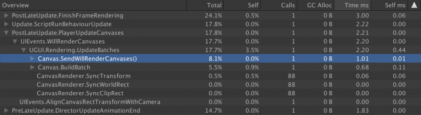
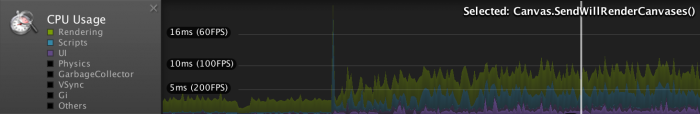
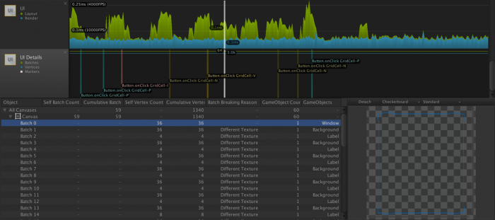
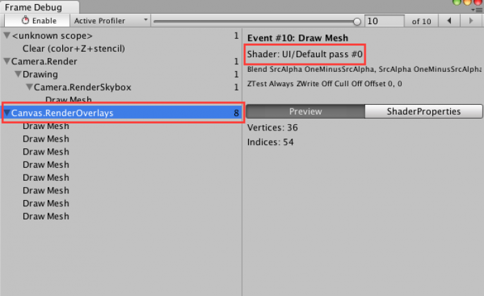
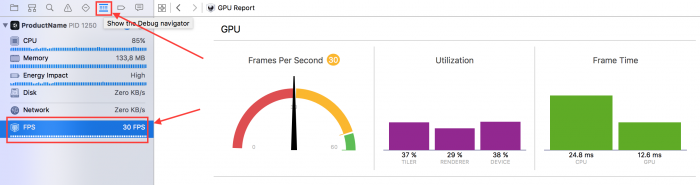
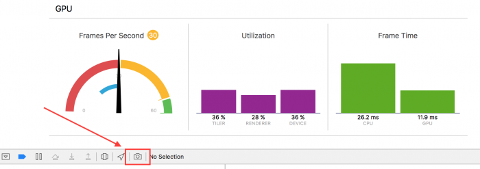
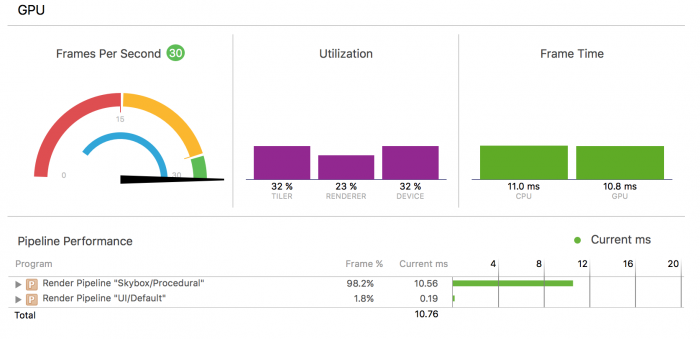

# Optimizing Unity UI

Optimizing a user interface driven by Unity UI is an art. This guide will discuss the fundamental concepts, algorithms and code underlying Unity UI as well as discussing common problems and solutions.

## 1. A guide to optimizing Unity UI

Optimizing a user interface driven by Unity UI is an art. Hard-and-fast rules are rare; instead, each situation must be carefully evaluated with the system’s behavior in mind. The core tension when optimizing any Unity UI is the balancing of draw calls with batching costs. While some common-sense techniques can be used to reduce one or the other, complex UIs must make trade-offs.

However, as is best practice elsewhere, attempts to optimize Unity UIs should begin with profiling. The primary task before attempting to optimize a Unity UI system is to locate the precise reason for an observed performance problem. There are four common classes of problems encountered by users of Unity UI:

*   Excessive GPU fragment shader utilization (i.e. fill-rate overutilization)
*   Excessive CPU time spent rebuilding a Canvas batch
*   Excessive numbers of rebuilds of Canvas batches (over-dirtying)
*   Excessive CPU time spent generating vertices (usually from text)

It is, in principle, possible to create a Unity UI whose performance is constrained by the sheer number of draw calls being sent to the GPU. However, in practice, any project overloading the GPU with draw calls is more likely to be bound by fill-rate overutilization.

This guide will discuss the fundamental concepts, algorithms and code underlying Unity UI as well as discussing common problems and solutions. It is broken into five chapters:

1.  The [Fundamentals of Unity UI] chapter defines terminology specific to Unity UI and discusses the details of many of the fundamental processes performed to render the UI, including the building of batched geometry. It is strongly recommended that readers begin with this chapter.
2.  The [Unity UI profiling tools] chapter discusses gathering profiling data with the various tools available to developers.
3.  The [Fill-rate, Canvases and input] chapter discusses ways to improve the performance of Unity UI's Canvas and Input Components.
4.  The [UI controls] chapter discusses UI Text, Scroll Views and other component-specific optimizations, along with some techniques that do not fit well elsewhere.
5.  The [Other techniques and tips] chapter discusses a handful of issues that do not fit elsewhere, including some basic tips and workarounds for "gotchas" in the UI system.

**UI Source Code**

Always remember that Unity UI’s Graphic and Layout components are entirely open source. Their source code can be found on [Unity’s Bitbucket repository], under [UI].

## 2. Fundamentals of Unity UI

It is important to understand the different parts making up the Unity UI system. There are several fundamental classes and components that, together, compose the system. This chapter first defines a number of terms used throughout this series of articles, then discusses the low-level behavior of several of Unity UI's key systems.

**Terminology**

A Canvas is a native-code Unity component that is used by Unity’s rendering system to provide layered geometry that will be drawn in, or on top of, a game’s world-space.

Canvases are responsible for combining their constituent geometry into batches, generating the appropriate render commands and sending these to Unity’s Graphics system. All of this is done in native C++ code, and is called a rebatch or a batch build. When a Canvas has been marked as containing geometry that requires rebatching, the Canvas is considered dirty.

Geometry is provided to Canvases by Canvas Renderer components.

A Sub-canvas is simply a Canvas component that is nested inside another Canvas component. Sub-canvases isolate their children from their parent; a dirty child will not force a parent to rebuild its geometry, and vice versa. There are certain edge cases where this is not true, such as when changes to a parent Canvas cause a child Canvas to be resized.

A Graphic is a base class provided by the Unity UI C# library. It is the base class for all Unity UI C# classes that provide drawable geometry to the Canvas system. Most built-in Unity UI Graphics are implemented via the MaskableGraphic subclass, which allows them to be masked via the IMaskable interface. The major subclasses of Drawable are Image and Text, which provide their eponymous components.

Layout components control the size and positioning of RectTransforms, and are generally used to create complex layouts that require relative sizing or relative positioning of their contents. Layout components rely only on RectTransforms and only affect the properties of their associated RectTransforms. They are not dependent on the Graphic class, and can be used independently from Unity UI’s Graphic components.

Both Graphic and Layout components rely on the CanvasUpdateRegistry class, which is not exposed in the Unity Editor's interface. This class tracks the set of Layout components and Graphic components that must be updated, and triggers updates as needed when their associated Canvas invokes the willRenderCanvases event.

The updates of Layout and Graphic components is called a rebuild. The rebuild process is discussed in further detail later in this document.

**Rendering details**

When composing user interfaces in Unity UI, keep in mind that all geometry drawn by a Canvas will be drawn in the Transparent queue. That is, geometry produced by Unity UI will always be drawn back-to-front with alpha blending. The important thing to remember from a performance standpoint is that each pixel rasterized from a polygon will be sampled, even if it is wholly covered by other, opaque polygons. On mobile devices, this high level of overdraw can rapidly exceed the fill-rate capacity of the GPU.

**The Batch building process (Canvases)**

The batch building process is the process whereby a Canvas combines the meshes representing its UI elements and generates the appropriate rendering commands to send to Unity’s graphics pipeline. The results of this process are cached and reused until the Canvas is marked as dirty, which occurs whenever there is a change to one of its constituent meshes.

The meshes used by the Canvas are taken from the set of Canvas Renderer components attached to the Canvas but not contained in any Sub-canvas.

Calculating the batches requires sorting the meshes by depth and examining them for overlaps, shared materials and so on. This operation is multi-threaded, and so its performance will generally be very different across different CPU architectures, and especially between mobile SoCs (which generally have few CPU cores) and modern desktop CPUs (which often have 4 or more cores).

**The rebuild process (Graphics)**

The Rebuild process is where the layout and meshes of Unity UI’s C# Graphic components are recalculated. This is performed in the CanvasUpdateRegistry class. Remember, this is a C# class and its source can be found on [Unity’s Bitbucket].

Within CanvasUpdateRegistry, the method of interest is PerformUpdate. This method is invoked whenever a Canvas component invokes the [WillRenderCanvases] event. This event is called once per frame.

PerformUpdate runs a three-step process:

*   Dirty Layout components are requested to rebuild their layouts, via the [ICanvasElement.Rebuild] method.
*   Any registered Clipping components (such as Masks) are requested to cull any clipped components. This is done via ClippingRegistry.Cull.
*   Dirty Graphic components are requested to rebuild their graphical elements.

For Layout and Graphic rebuilds, the process is split into multiple parts. Layout rebuilds run in three parts (PreLayout, Layout and PostLayout) while Graphic rebuilds run in two (PreRender and LatePreRender).

**Layout rebuilds**

To recalculate the appropriate positions (and potentially sizes) of components contained within one or more Layout components, it is necessary to apply the Layouts in their appropriate hierarchical order. Layouts closer to the root in the GameObject hierarchy can potentially alter the positions and sizes of any Layouts that may be nested within them, and so must be calculated first.

To do this, Unity UI sorts the list of dirty Layout components by their depth in the hierarchy. Items higher in the hierarchy (i.e. with fewer parent Transforms) are moved to the front of the list.

The sorted list of Layout components is then requested to rebuild their layouts; this is where the positions and sizes of UI elements controlled by Layout components are actually altered. For more details on how the positions of individual elements are affected by Layouts, see the [UI Auto Layout] section of the Unity Manual.

**Graphic rebuilds**

When Graphic components are rebuilt, Unity UI passes control to the [Rebuild] method of the [ICanvasElement] interface. Graphic implements this and runs two different rebuild steps during the PreRender stage of the Rebuild process.

*   If the vertex data has been marked as dirty (e.g. when the component’s RectTransform has changed size), then the mesh is rebuilt.
*   If the material data has been marked dirty (e.g. when the component’s material or texture has been changed), then the attached Canvas Renderer’s material will be updated.

Graphic Rebuilds do not proceed through the list of Graphic components in any particular order, and do not require any sorting operations.

## 3. Unity UI Profiling Tools

There are several profiling tools useful for analyzing Unity UI’s performance. The key tools are:

*   Unity Profiler
*   Unity Frame Debugger
*   Xcode’s Instruments or Intel VTune
*   Xcode’s Frame Debugger or Intel GPA

The external tools provide method-level CPU profiling with millisecond (or better) resolution, as well as detailed draw-call and shader profiling. Instructions for setting up and using the above tools lie beyond the scope of this guide. Note that the XCode Frame Debugger and Instruments are only usable on IL2CPP builds for Apple platforms, and therefore can currently only be used to profile iOS builds.

**Unity Profiler**

The primary use for the Unity Profiler is to perform comparative profiling: enabling and disabling elements of a UI while the Unity Profiler is running can quickly narrow down the portions of a UI hierarchy that are most responsible for performance issues.

To analyze this, watch the Canvas.BuildBatch and Canvas.SendWillRenderCanvases lines in the profiler’s output.



Canvas.BuildBatch is the native-code calculations that perform the Canvas Batch Building process, as described previously.

Canvas.SendWillRenderCanvases contains the invocation of the C# scripts that are subscribed to the Canvas component’s willRenderCanvases Event. Unity UI’s CanvasUpdateRegistry class receives this event and uses it to run the Rebuild process, described previously. It is expected that any dirty UI components will update their Canvas Renderers at this time.

Note: To more easily see differences in UI performance, it is generally advisable to disable all of the trace categories aside from “Rendering”, “Scripts” and “UI”. This can be done by clicking on the colored boxes beside the name of the trace category on the left-hand side of the CPU Usage profiler. The categories can also be re-ordered in the CPU profiler by clicking and dragging the names of the categories upwards or downwards.



The UI category is new in Unity 2017.1 and up. Unfortunately, parts of the UI update process are not categorized correctly, so be careful when looking at the UI curve because it may not contain all UI related calls. For example, Canvas.SendWillRenderCanvases is categorized as "UI", but Canvas.BuildBatch is categorized as “Others” and “Rendering”.

In 2017.1 and up, there’s also a new [UI Profiler]. By default, this profiler is the last one in the Profiler window. It consists of two timelines and a batch viewer:



The first timeline shows the CPU time spent in two categories, respectively computing layout and rendering. Note that it suffers from the same problem described previously and some UI functions may not be accounted for.

The second timeline shows the total number of batches, vertices and also displays event markers. In the previous screenshot, you can see a couple of button click events. These markers can help you determine what caused a CPU spike.

Finally, the most useful feature of the UI Profiler is the batch viewer at the bottom. On the left, there’s a tree view of all your canvases and underneath each of them, a list of the batches they generated. The columns provide interesting details about each canvas or batch, but there’s one in particular that is crucial to better understand how to optimize your UI and it’s the Batch Breaking Reason.

This column will show why the selected batch couldn’t be merged with the previous one. Reducing the number of batches is one of the most effective way of improving UI performance, so it’s important to understand what breaks batching.

One of the most frequent reason, as shown in the screenshot, is a UI element using a different texture or material. In many cases, this can easily be fixed by using [sprite atlases.] The last column shows the name of the game objects associated with the batch. You can double click on the name to select the game object in the editor (this is particularly helpful when you have several objects with the same name).

As of Unity 2017.3, the batch viewer only works in the editor. The batching should usually be the same on device, so this is still really helpful. If you have doubt that batches may be different on device, then you can use the Frame Debugger that will be described next.

**Unity Frame Debugger**

The Unity Frame Debugger is a useful tool for reducing the number of draw calls generated by a Unity UI. This built-in tool can be accessed via the Window menu within the Unity Editor. When enabled, it will display all draw calls generated by Unity, including those generated by Unity UI.

Notably, the frame debugger will update itself with the draw calls generated to display the Game View in the Unity Editor, and therefore can be used to try out different UI configurations without even entering Play Mode.

The location of the Unity UI draw calls depends on the Render Mode selected on the Canvas component being drawn:

*   Screen Space – Overlay will appear within Canvas.RenderOverlays group
*   Screen Space – Camera will appear within the Camera.Render group of the selected Render Camera, as a subgroup of Render.TransparentGeometry
*   World Space will appear as a subgroup of Render.TransparentGeometry for each World Space camera in which the Canvas is visible

All UIs can be identified by the “Shader: UI/Default” line (assuming that the UI shader has not been replaced with a custom shader). in the group or draw call’s details. See the highlighted red boxes in the below screenshot.



By watching this set of lines while tweaking a UI, it is relatively simple to maximize the Canvas’ ability to combine UI elements into batches. The most common design-related cause of broken batches is unintentional overlap.

All Unity UI components generate their geometry as a series of quads. However, many UI sprites or UI text glyphs occupy only a fraction of the quads used to represent them, with the rest being empty space. As a result, it is quite common to find that the UI’s designer has unintentionally overlapped multiple different quads whose textures come from different materials and therefore cannot be batched.

As Unity UI operates entirely in the transparent queue, any quads that have unbatchable quads overlaid atop them must be drawn before the unbatchable quads, and therefore cannot be batched with other quads placed atop the unbatchable quads.

Consider a case of three quads, A, B, and C. Assume all three quads overlap one another, and also assume quads A and C use the same material while quad B uses a separate material. Quad B therefore cannot be batched with A or C.

If the order in the hierarchy (from top to bottom) is A, B, C then A and C cannot be batched, because B must be drawn atop A and beneath C. However, if B is placed before or after the batchable quads, then the batchable quads can actually be batched – B needs only to be drawn before or after the batched quads and does not interpose them.

For further discussion of this issue, see the Child order section of the Canvas step.

**Instruments & VTune**

Xcode’s Instruments and Intel’s VTune allow for extremely deep profiling of Unity UI rebuilds and Canvas batch calculations on Apple or Intel CPUs, respectively. The method names are nearly identical to the profiler labels discussed above in the Unity Profiler section:

*   Canvas::SendWillRenderCanvases is the C++ parent that calls the Canvas.SendWillRenderCanvases C# method and governs that line in the Unity Profiler. It will contain the code used to run the Rebuild process, as described in the previous step.
*   Canvas::UpdateBatches is identical to Canvas.BuildBatch, but includes additional boilerplate code not covered by the Unity Profiler label. It runs the actual Canvas Batch Building process, described above.

When used in conjunction with a Unity app built via IL2CPP, these tools can be used to drill down deeper into the transpiled C# code of Canvas::SendWillRenderCanvases. Of primary interest will be the cost of the following methods. (Note: transpiled method names are approximate.)

*   IndexedSet\_Sort and CanvasUpdateRegistry\_SortLayoutList are used to sort the list of dirty Layout components before the layouts are recalculated. As described above, this involves calculating the number of parent transforms above each Layout component.
*   ClipperRegistry\_Cull calls all registered implementers of the IClipRegion interface. Built-in implementers include [RectMask2D], which uses the IClippable interface. During ClipperRegistry.Cull calls, RectMask2D components loop over all clippable elements contained within their hierarchy and asks them to update their culling information.
*   Graphic\_Rebuild will contain the cost of actually calculating the meshes needed to represent Image, Text or other Graphic-derived components. Beneath this will be several other methods like Graphic\_UpdateGeometry and, most notably, Text\_OnPopulateMesh.
*   Text\_OnPopulateMesh is generally a hotspot when Best Fit is enabled. This is discussed in more detail later in this guide.
*   Mesh modifiers, such as Shadow\_ModifyMesh and Outline\_ModifyMesh, will also run here. The cost of calculating component drop shadows, outlines and other special effects can be seen via these methods.

**Xcode Frame Debugger &amp; Intel GPA**

Low-level frame debugging tools are essential for profiling the cost of individual portions of the batched UI as well as monitoring the cost of UI overdraw. UI overdraw is discussed in more detail later in this guide.

**Using the Xcode Frame Debugger**

To test whether a given UI is overstressing the GPU, Xcode’s built-in GPU diagnostics tools can be employed. First, configure the project in question to use Metal or OpenGLES3, then make a build and open the resulting Xcode project. Some Xcode version and device combinaisons may support OpenGLES 2 frame captures, but there’s no guarantee it will work.

Note: On some versions of Xcode, it is necessary to select the appropriate Graphics API in the Build Scheme in order to make the graphics profiler work. To do this, go to the Product menu in Xcode, expand the Scheme menu item, and choose Edit Scheme.... Select the Run target and go to the Options tab. Change the GPU Frame Capture option to match the API used by your project. Assuming the Unity project is set up to automatically select a graphics API, then most modern iPads will default to using Metal. If in doubt, start the project and look at the debug logs in Xcode. One of the early lines should indicate which rendering path (Metal, GLES3 or GLES2) is being initialized.

Build and run the project on an iOS device. The GPU profiler can be found by showing the Debug pane in Xcode’s Navigator sidebar, and clicking on the FPS entry.



The first point of interest in the GPU profiler is the set of three bars in the center of the screen, labeled “Tiler”, “Renderer”, and “Device”. Of these two:

*   “Tiler” is generally a measure of how stressed the GPU is by processing geometry, which includes time spent in vertex shaders. Generally, a high “Tiler” usage indicates either excessively slow vertex shaders or an excessive number of vertices being drawn.
*   “Renderer” is generally a measure of how stressed the GPU’s pixel pipelines are. Generally, high “Renderer” usage indicates that an application is exceeding the maximum fill-rate of the GPU, or has inefficient fragment shaders.
*   “Device” is a composite measure of overall GPU usage, which includes both “Tiler” and “Renderer” performance. It can generally be ignored, as it will roughly track the higher of the “Tiler” or “Renderer” measurements.

Xcode’s Frame Debugger can be triggered by clicking on the small ‘Camera’ icon hidden at the bottom of the GPU profiler. It is highlighted by an arrow and a red box in the following screenshot.



After a brief pause, the Frame Debugger’s summary view should appear, like so:



When using the default UI shader, the cost of rendering geometry generated by the Unity UI system will show up under the “UI/Default” shader pass, assuming the default UI shader has not been replaced with a custom shader. It is possible to see this default UI shader in the above screenshot as Render Pipeline “UI/Default.”

Unity UI only generates quads and so the vertex shader is unlikely to stress the tiler pipeline of the GPU. Any problems that appear in this shader pass are likely due to fill-rate issues.

**Analyzing profiler results**

After gathering profiling data, several conclusions might be drawn. If Canvas.BuildBatch or Canvas::UpdateBatches seems to be using an excessive amount of CPU time, then the likely problem is an excessive number of Canvas Renderer components on a single Canvas. See the Splitting Canvases section of the Canvas step.

If an excessive amount of time is spent drawing the UI on the GPU, and the frame debugger indicates that the fragment shader pipeline is the bottleneck, then the UI is likely exceeding the pixel fill rate which the GPU is capable of. The most likely cause is excessive UI overdraw. See the Remediating fill-rate issues section of the Fill-rate, Canvases and input step.

If Graphic Rebuilds are using excessive CPU, as seen by a large portion of CPU time going to Canvas.SendWillRenderCanvases or Canvas::SendWillRenderCanvases, then deeper analysis is needed. Some portion of the Graphic Rebuild process is likely responsible.

In the case that a large portion of WillRenderCanvas is spent inside IndexedSet\_Sort or CanvasUpdateRegistry\_SortLayoutList, then time is being spent sorting the list of dirty Layout components. Consider reducing the number of Layout components on the Canvas. See Replacing layouts with RectTransforms and Splitting Canvases sections for possible remediations.

If excessive time seems to be spent in Text\_OnPopulateMesh, then the culprit is simply the generation of text meshes. See the Best Fit and Disabling Canvases sections for possible remediations, and consider the advice inside Splitting Canvases if much of the text being rebuilt is not actually having its underlying string data changed.

If time is spent inside Shadow\_ModifyMesh or Outline\_ModifyMesh (or any other implementation of ModifyMesh), then the problem is excessive time spent calculating mesh modifiers. Consider removing these components and achieving their visual effect via static images.

If there is no particular hotspot within Canvas.SendWillRenderCanvases, or it appears to be running every frame, then the problem is likely that dynamic elements have been grouped together with static elements and are forcing the entire Canvas to rebuild too frequently. See the Splitting Canvases step.

## 4. Fill-rate, Canvases and input

This chapter discusses broader issues with structuring Unity UIs.

**Remediating fill-rate issues**

There are two courses of action that can be taken to reduce the stress on the GPU’s fragment pipeline:

*   Reducing the complexity of fragment shaders. See the “UI shaders and low-spec devices” section for more details.
*   Reducing the number of pixels that must be sampled.

As the UI shader is generally standardized, the most common problem is simply excessive fill-rate usage. This is most commonly due to a large number of overlapping UI elements and/or having multiple UI elements that occupy significant portions of the screen. Both of these problems can lead to extremely high levels of overdraw.

In order to alleviate fill-rate overutilization and reduce overdraw, consider the following possible remediations.

**Eliminating invisible UI**

The method that requires the least redesigning of existing UI elements is to simply disable elements that are not visible to the player. The most common case where this is applicable is opening full-screen UIs with opaque backgrounds. In this case, any UI elements placed beneath the full-screen UI can be disabled.

The simplest way to do this is to disable the root GameObject or GameObjects containing the invisible UI elements. For an alternate solution, see the [Disabling Canvases] section.

Finally, make sure that no UI elements are hidden by setting their alpha to 0, as the element will still be sent to the GPU and may take precious rendering time. If a UI element doesn’t need a Graphic component, you can simply remove it and raycasting will still work.

**Simplify UI structure**

To reduce the time required to rebuild and render the UI, it is important to keep the number of UI objects as low as possible. Try to bake things as much as you can. For example, don’t use a blended GameObject just to change the hue to an element, do this via material properties instead. Also, don’t create game objects acting like folders and having no other purpose than organizing your Scenes.

**Disabling invisible camera output**

If a full-screen UI with an opaque background is opened, the world-space camera will still render the standard 3D scene behind the UI. The renderer is not aware that the full-screen Unity UI will obscure the entire 3D scene.

Therefore, if a completely full-screen UI is opened, disabling any and all of the obscured world-space cameras will help reduce GPU stress by simply eliminating the useless work of rendering the 3D world.

If the UI doesn’t cover the whole 3D scene, you may want to render the scene to a texture once and use it instead of continuously render it. You will lose the possibility to see animated content in the 3D scene, but that should be acceptable most of the time.

Note: If a Canvas is set as “Screen Space – Overlay”, then it will be drawn irrespective of the number of cameras active in the scene.

**Majority-obscured cameras**

Many “full-screen” UIs do not actually obscure the entire 3D world, but leave a small portion of the world visible. In these cases, it may be more optimal to capture just the portions of the world that are visible into a render texture. If the visible portion of the world is “cached” in a render texture, then the actual world-space camera can be disabled, and the cached render texture can be drawn behind the UI screen to provide an impostor version of the 3D world.

**Composition-based UIs**

It is very common for designers to create UIs via composition – combining and layering standard backgrounds and elements to create the final UI. While this is relatively simple to do, and very friendly to iteration, it is non-performant due to Unity UI’s use of the transparent rendering queue.

Consider a simple UI with a background, a button and some text on the button. Because objects in the transparent queue are sorted from back to front, in the case that a pixel falls within a text glyph, the GPU must sample the background’s texture, then the button’s texture, and finally the text atlas’ texture, for a total of three samples. As the complexity of the UI grows, and more decorative elements are layered onto the background, the number of samples can rise rapidly.

If a large UI is discovered to be fill-rate bound, the best recourse is to create specialized UI sprites that merge as many of the decorative/invariant elements of the UI into its background texture. This reduces the number of elements that must be layered atop one another to achieve the desired design, but is labor-intensive and increases the size of the project’s texture atlases.

This principle of condensing the number of layered elements necessary to create a given UI onto specialized UI sprites can also be used for sub-elements. Consider a store UI with a scrolling pane of products. Each product UI element has a border, a background, and some icons to denote price, name and other information.

The store UI will need a background, but because its products scroll across the background, the product elements cannot be merged onto the store UI’s background texture. However, the border, price, name and other elements of the product’s UI element could be merged onto the product’s background. Depending on the size and number of icons, the fill-rate savings can be considerable.

There are several drawbacks to combining layered elements. Specialized elements can no longer be reused, and require additional artist resources to create. The addition of large new textures may significantly increase the amount of memory needed to hold the UI textures, particularly if the UI textures are not loaded and unloaded on demand.

**UI shaders and low-spec devices**

The built-in shader used by Unity UI incorporates support for masking, clipping and numerous other complex operations. Because of this added complexity, the UI shader performs poorly compared to the simpler Unity 2D shader on low-end devices such as the iPhone 4.

If masking, clipping and other “fancy” features are unneeded for an application targeted at low-end devices, it is possible to create a custom shader that omits the unused operations, such as this minimal UI shader:

```
Shader "UI/Fast-Default" 
{ 
	Properties { 
		[PerRendererData] 
		_MainTex ("Sprite Texture", 2D) = "white" {} 
		_Color ("Tint", Color) = (1,1,1,1)
	}
	SubShader
	{
	    Tags
	    { 
	        "Queue"="Transparent" 
	        "IgnoreProjector"="True" 
	        "RenderType"="Transparent" 
	        "PreviewType"="Plane"
	        "CanUseSpriteAtlas"="True"
	    }
	
	    Cull Off
	    Lighting Off
	    ZWrite Off
	    ZTest [unity_GUIZTestMode]
	    Blend SrcAlpha OneMinusSrcAlpha
	
	    Pass
	    {
	    CGPROGRAM
	        #pragma vertex vert
	        #pragma fragment frag
	
	        #include "UnityCG.cginc"
	        #include "UnityUI.cginc"
	
	        struct appdata_t
	        {
	            float4 vertex   : POSITION;
	            float4 color    : COLOR;
	            float2 texcoord : TEXCOORD0;
	        };
	
	        struct v2f
	        {
	            float4 vertex   : SV_POSITION;
	            fixed4 color    : COLOR;
	            half2 texcoord  : TEXCOORD0;
	            float4 worldPosition : TEXCOORD1;
	        };
	
	        fixed4 _Color;
	        fixed4 _TextureSampleAdd;
	        v2f vert(appdata_t IN)
	        {
	            v2f OUT;
	            OUT.worldPosition = IN.vertex;
	            OUT.vertex = mul(UNITY_MATRIX_MVP, OUT.worldPosition);
	
	            OUT.texcoord = IN.texcoord;
	
	            #ifdef UNITY_HALF_TEXEL_OFFSET
	            OUT.vertex.xy += (_ScreenParams.zw-1.0)*float2(-1,1);
	            #endif
	
	            OUT.color = IN.color * _Color;
	            return OUT;
	        }
	
	        sampler2D _MainTex;
	        fixed4 frag(v2f IN) : SV_Target
	        {
	            return (tex2D(_MainTex, IN.texcoord) + _TextureSampleAdd) * IN.color;
	        }
	    ENDCG
	    }
	}
}
```

**UI Canvas rebuilds**

To display any UI, the UI system must construct geometry for each UI component represented on-screen. This includes running dynamic layout code, generating polygons to represent characters in UI text strings, and merging as much geometry as possible into single meshes in order to minimize draw calls. This is a multi-step process and is described in detail in the [Fundamentals] section at the beginning of this guide.

Canvas rebuilds can become performance problems for two primary reasons:

*   If the number of drawable UI elements on a Canvas is large, then calculating the batch itself becomes very expensive. This is because the cost of sorting and analyzing the elements grows more-than-linearly to the number of drawable UI elements on the Canvas.
*   If the Canvas is dirtied frequently, then excessive time may be spent refreshing a Canvas that has relatively few changes.

Both of these problems tend to become acute as the number of elements on a Canvas increases.

Important reminder: Whenever any drawable UI element on a given Canvas changes, the Canvas must re-run the batch building process. This process re-analyzes every drawable UI element on the Canvas, regardless of whether it has changed or not. Note that a “change” is any change which affects a UI object’s appearance, including the sprite assigned to a sprite renderer, transform position & scale, the text contained in a text mesh, etc.

**Child order**

Unity UIs are constructed back-to-front, with objects’ order in the hierarchy determining their sort order. Objects earlier in the hierarchy are considered behind objects later in the hierarchy. Batches are built by walking the hierarchy top-to-bottom and collecting all objects which use the same material, the same texture and do not have intermediate layers. An “intermediate layer” is a graphical object with a different material, whose bounding box overlaps two otherwise-batchable objects and is placed in the hierarchy between the two batchable objects. Intermediate layers force batches to be broken.

As discussed in the Unity UI Profiling Tools step, the UI profiler and frame debugger can be used to inspect a UI for intermediate layers. This is the situation where one drawable object interposes itself between two other drawable objects that are otherwise batchable.

This problem most commonly occurs when text and sprites are located near one another: the text’s bounding box can invisibly overlap nearby sprites, because much of a text glyph’s polygon is transparent. This can be solved in two ways:

*   Reorder the drawables so that the batchable objects are not interposed by the non-batchable object; that is, move the non-batchable object above or below the batchable objects.
*   Tweak the positions of the objects to eliminate invisible overlapping space.

Both of these operations can be carried out in the Unity Editor with the Unity Frame Debugger open and enabled. By simply observing the number of draw calls visible in the Unity Frame Debugger, it is possible to find an order and position that minimizes the number of draw calls wasted due to overlapping UI elements.

**Splitting Canvases**

In all but the most trivial cases, it is generally a good idea to split up a Canvas, either by moving elements to a Sub-canvas or to a sibling Canvas.

Sibling Canvases are best used in cases where certain portions of a UI must have their draw depth controlled separately from the rest of the UI, to be always above or below other layers (e.g. tutorial arrows).

In most other cases, Sub-canvases are more convenient as they inherit their display settings from their parent Canvas.

While it may seem at first glance that it is a best practice to subdivide a UI into many Sub-canvases, remember that the Canvas system also does not combine batches across separate Canvases. Performant UI design requires a balance between minimizing the cost of rebuilds and minimizing wasted draw calls.

**General guidelines**

Because a Canvas rebatches any time any of its constituent drawable components changes, it is generally best to split any non-trivial Canvas into at least two parts. Further, it is best to try to co-locate elements on the same Canvas if the elements are expected to change simultaneously. An example might be a progress bar and a countdown timer. These both rely on the same underlying data and therefore will require updates at the same time, and so they should be placed on the same Canvas.

On one Canvas, place all elements that are static and unchanging, such as backgrounds and labels. These will batch once, when the Canvas is first displayed, and then will no longer need to rebatch afterwards.

On the second Canvas, place all of the “dynamic” elements – the ones that change frequently. This will ensure that this Canvas is rebatching primarily dirty elements. If the number of dynamic elements grows very large, it may be necessary to further subdivide the dynamic elements into a set of elements that are constantly changing (e.g. progress bars, timer readouts, anything animated) and a set of elements that change only occasionally.

This is actually rather difficult in practice, especially when encapsulating UI controls into prefabs. Many UIs instead elect to subdivide a Canvas by splitting out the costlier controls onto a Sub-canvas.

**Unity 5.2 and Optimized Batching**

In Unity 5.2, the batching code was substantially rewritten, and is considerably more performant compared to Unity 4.6, 5.0 and 5.1. Further, on devices with more than 1 core, the Unity UI system will move most of the processing to worker threads. In general, Unity 5.2 reduces the need for aggressively splitting a UI into dozens of Sub-canvases. Many UIs on mobile devices can now be made performant with as few as two or three Canvases.

More information on the optimizations in Unity 5.2 can be found in [this blog post].

**Input and raycasting in Unity UI**

By default, Unity UI uses the [Graphic Raycaster] component to handle input events, such as touch events and pointer-hover events. This is generally handled by the Standalone Input Manager component. Despite the name, the Standalone Input Manager is meant to be a “universal” input manager system, and will handle both pointers and touches.

**Erroneous mouse input detection on mobile (5.3)**

Prior to Unity 5.4, each active Canvas with a Graphic Raycaster attached will run a raycast once per frame to check the position of the pointer so long as there is currently no touch input available. This will occur regardless of platform; iOS and Android devices without mice will still query the mouse’s position and attempt to discover which UI elements are beneath that position to determine if any hover events need to be sent.

This is a waste of CPU time, and has been witnessed consuming 5% or more of a Unity application’s CPU frame time.

This issue is resolved in Unity 5.4. From 5.4 onward, devices without mice will not query for the mouse position and will not perform unnecessary raycasts.

If using a version of Unity older than 5.4, it is strongly recommended that mobile developers create their own Input Manager class. This can be as simple as copying Unity’s Standard Input Manager from the Unity UI source and commenting out the ProcessMouseEvent method as well as all calls to that method.

**Raycast optimization**

The Graphic Raycaster is a relatively straightforward implementation that iterates over all Graphic components that have the ‘Raycast Target’ setting set to true. For each Raycast Target, the Raycaster performs a set of tests. If a Raycast Target passes all of its tests, then it is added to the list of hits.

**Raycast implementation details**

*   If the Raycast Target is active, enabled and is drawn (i.e. has geometry)
*   If the input point lies within the RectTransform to which the Raycast Target is attached
*   If the Raycast Target has, or is a child (at any depth) of, any [ICanvasRaycastFilter] component, and that Raycast Filter component permits the Raycast.

The list of hit Raycast Targets is then sorted by depth, filtered for reversed targets, and filtered to ensure that elements rendered behind the camera (i.e. not visible in the screen) are removed.

The Graphic Raycaster also may cast a ray into the 3D or 2D physics system if the respective flag is set on the Graphic Raycaster’s “Blocking Objects” property. (From script, the property is named [blockingObjects].)

If 2D or 3D blocking objects are enabled, then any Raycast Targets that draw beneath a 2D or 3D object on a raycast-blocking Physics Layer will also be eliminated from the list of hits.

The final list of hits is then returned.

**Raycasting optimization tips**

Given that all Raycast Targets must be tested by the Graphic Raycaster, it is a best practice to only enable the ‘Raycast Target’ setting on UI components that must receive pointer events. The smaller the list of Raycast Targets, and the shallower the hierarchy that must be traversed, the faster each Raycast test will be.

For composite UI controls that have multiple drawable UI objects that must respond to pointer events, such as a button that wishes to have its background and text both change colors, it is generally better to place a single Raycast Target at the root of the composite UI control. When that single Raycast Target receives a pointer event, it can then forward the event to each interested component within the composite control.

**Hierarchy depth and raycast filters**

Each Graphic Raycast traverses the Transform hierarchy all the way to the root when searching for raycast filters. The cost of this operation grows linearly in proportion to the depth of the hierarchy. All components found attached to each Transform in the hierarchy must be tested to see if they implement [ICanvasRaycastFilter], so this is not a cheap operation.

**Sub-canvases and the OverrideSorting property**

The [overrideSorting] property on a Sub-canvas will cause a Graphic Raycast test to stop climbing the transform hierarchy. If it can be enabled without causing sorting or raycast detection issues, then it should be used to decrease the cost of raycast hierarchy traversals.

## 5. Optimizing UI Controls

This section of the Optimizing Unity UI guide focuses on issues specific to certain types of UI controls. While most UI controls are relatively similar in terms of performance, two stand out as being the causes of many of the performance issues encountered in games close to a shippable state.

**UI text**

Unity’s built-in Text component is a convenient way of displaying rasterized text glyphs within a UI. However, there are a number of behaviors that are not commonly known, yet frequently appear as performance hotspots. When adding text to a UI, always remember that the text glyphs are actually rendered as individual quads, one per character. These quads tend to have a significant amount of empty space surrounding the glyph, depending on its shape, and it is very easy to position text in such a way that it unintentionally breaks the batching of other UI elements.

**Text mesh rebuilds**

One major issue is the rebuilding of UI text meshes. Whenever a UI Text component is changed, the text component must recalculate the polygons used to display the actual text. This recalculation also occurs if a text component, or any of its parent GameObjects, is simply disabled and re-enabled without changes to the text.

This behavior is problematic for any UI that displays large numbers of textual labels, with the most common being leaderboards or statistics screens. As the most common way to hide and show a Unity UI is to enable/disable a GameObject containing the UI, UIs with large numbers of text components will often cause undesirable frame-rate hiccups whenever they are displayed.

For a potential workaround to this issue, see the Disabling Canvases section in the next step.

**Dynamic fonts and font atlases**

Dynamic fonts are a convenient way to display text when the full displayable character set is either very large, or not known prior to runtime. In Unity’s implementation, these fonts build a glyph atlas at runtime based on the characters encountered within UI Text components.

Each distinct Font object loaded will maintain its own texture atlas, even if it is in the same font family as another font. For example, using Arial with bolded text on one control while using Arial Bold on another control will produce identical output but Unity will maintain two distinct texture atlases - one for Arial and one for Arial Bold.

From a performance perspective, the most important thing to understand is that Unity UI’s dynamic fonts maintain one glyph in the font’s texture atlas for each distinct combination of size, style & character. That is, if a UI contains two text components, both displaying the letter ‘A’, then:

*   If the two Text components share the same size, the font atlas will have one glyph in it.
*   If the two Text components do not share the same size (e.g. one is 16-point, the other 24-point), then the font atlas will contain two copies of the letter ‘A’ at different sizes.
*   If one Text component is bold and the other is not, then the font atlas will contain a bold 'A' and a regular 'A'.

Whenever a UI Text object with a dynamic font encounters a glyph that has not yet been rasterized into the font’s texture atlas, the font’s texture atlas must be rebuilt. If the new glyph fits into the current atlas, it is added and the atlas re-uploaded to the graphics device. However, if the current atlas is too small, then the system attempts to rebuild the atlas. It does this in two stages.

First, the atlas is rebuilt at the same size, using only the glyphs currently being shown by active UI Text components. This includes UI Text components whose parent Canvases are enabled, but that have disabled Canvas Renderers. If the system succeeds in fitting all currently-in-use glyphs into a new atlas, it rasterizes that atlas and does not continue to the second step.

Second, if the set of currently-in-use glyphs cannot be fit into an atlas of the same size as the current atlas, a larger atlas is created by doubling the atlas’ shorter dimension. For example, a 512x512 atlas expands into 512x1024 atlas.

Due to the above algorithm, a dynamic font’s atlas will only grow in size once created. Given the cost of rebuilding the texture atlases, it is imperative to minimize during rebuilds. This can be done in two ways.

Whenever possible, use non-dynamic fonts and preconfigure support for the desired glyph set. This generally works well for UIs using a well-constrained character set, such as only the Latin/ASCII characters, and with a small range of sizes.

If an extremely large range of characters must be supported, such as the entire Unicode set, then the font must be set to Dynamic. To avoid predictable performance problems, prime the font’s glyph atlas at startup time with a set of appropriate characters via [Font.RequestCharactersInTexture].

Note that font atlas rebuilds are triggered individually for each UI Text component that is changed. When populating an extremely large number of Text components, it may be advantageous to collect all unique characters in the Text components’ content and prime the font atlas. This will ensure that the glyph atlas need only be rebuilt once instead of being rebuilt once each time a new glyph is encountered.

Also note that, when a font atlas rebuild is triggered, any characters that are not presently contained in an active UI Text component will not be present in the new atlas, even if they were originally added to the atlas as a result of a call to [Font.RequestCharactersInTexture]. To work around this limitation, subscribe to the Font.textureRebuilt delegate and query [Font.characterInfo] to ensure that all desired characters remain primed.

The Font.textureRebuilt delegate is currently undocumented. It is a [single-argument Unity Event]. The argument is the font whose texture was rebuilt. Subscribers to this event should follow the following signature:

```cs
public void TextureRebuiltCallback(Font rebuiltFont) { /* ... */ }
```

**Specialized glyph renderers**

For situations where the glyphs are well-known, with relatively fixed positions between each glyph, it is significantly more advantageous to write a custom component to display sprites displaying those glyphs. An example of this might be a score display.

For scores, the displayable characters are drawn from a well-known glyph set (the digits 0-9), do not change across localities, and appear at fixed distances from one another. It is relatively trivial to decompose an integer into its digits and display appropriate digit sprites. This sort of specialized digit-display system can be built in a manner that is both allocationless and considerably faster to calculate, animate and display than the Canvas-driven UI Text component.

**Fallback fonts and memory usage**

For applications that must support a large character-set, it is tempting to list a large number of fonts in the “Font Names” field of a font importer. Any fonts listed in the “Font Names” field will be used as fallbacks if a glyph cannot be located within the primary font. The fallback order is determined by the order in which the fonts are listed in the “Font Names” field.

However, in order to support this behavior, Unity will keep all fonts listed in the “Font Names” field loaded into memory. If a font’s character set is very large, then the amount of memory consumed by fallback fonts can become excessive. This is most often seen when including pictographic fonts, such as Japanese Kanji or Chinese characters.

**Best Fit and performance**

In general, the UI Text component's Best Fit setting should never be used.

“Best Fit” dynamically adjusts the size of a font to the largest integer point size which can be displayed within a Text component’s bounding box without overflow, clamped to a configurable minimum/maximum point size. However, because Unity renders a distinct glyph into the font atlas for each distinct size of character being displayed, use of Best Fit will rapidly overwhelm the atlas with many different glyph sizes.

As of Unity 2017.3, the size detection used by Best Fit is nonoptimal. It generates glyphs in the font atlas for each size increment tested, which further increases the amount of time required to generate font atlases. It also tends to cause atlas overflows, which causes old glyphs to be kicked out of the atlas. Due to the large number of tests required for a Best Fit calculation, this will often evict glyphs in use by other Text components, and force the font atlas to be rebuilt at least once more after the appropriate font size has been calculated. This specific issue has been corrected in Unity 5.4, and Best Fit will not unnecessarily expand the font's texture atlas, but is still considerably slower than statically-sized text.

Frequent font atlas rebuilds will rapidly degrade runtime performance as well as cause memory fragmentation. The greater the quantity of text components set to Best Fit, the worse this problem becomes.

**TextMeshPro Text**

TextMesh Pro (TMP) is a replacement for Unity’s existing text components like Text Mesh and UI Text. TextMesh Pro uses Signed Distance Field (SDF) as its primary text rendering pipeline making it possible to render text cleanly at any point size and resolution. Using a set of custom shaders designed to leverage the power of SDF text rendering, TextMesh Pro makes it possible to dynamically change the visual appearance of the text by simply changing material properties to add visual styles such as dilation, outline, soft shadow, beveling, textures, glow, etc. and to save and recall these visual styles by creating/using material presets.

Until the release of 2018.1, TextMesh Pro was included in one’s project as a Asset Store package. As of 2018.1 TextMesh Pro will be available as a [Package Manager] package.

**Text mesh rebuilds**

Much like Unity’s built-in UIText component, making changes to the text displayed by the component will trigger calls to Canvas.SendWillRendererCanvases and Canvas.BuildBatch which can be costly. Minimize changes to the text field of a TextMeshProUGUI component and make sure to parent TextMeshProUGUI components whose text changes often to a parent GameObject that has its own Canvas component to ensure that Canvas rebuild calls remain as efficient as possible.

Do note that for text displayed in world space, we recommend that users use the normal TextMeshPro component instead of using TextMeshProUGUI as using Canvases in Worldspace can be inefficient. Using TextMeshPro directly will be more efficient given it doesn't have incur the canvas system overhead.

**Fonts and memory usage**

Given that there is no dynamic font feature in TMP, one must rely on fallback fonts. Understanding how fallback fonts are loaded and used is crucial to optimizing memory when using TMP.

Glyph discovery in TMP is done recursively – that is, when a glyph is missing from a TMP Font Asset, TMP iterates through the list of fallback Font Assets currently assigned or active starting with the first fallback on the list and through their own fallbacks. If the glyph is still not found, TMP will then search any Sprite Asset potentially assigned to the text object along with any fallback assigned to this Sprite Asset. If the desired glyph is still not located, TMP will then search recursively through the list of general fallbacks assigned in the TMP Settings file followed by the default Sprite Asset. If still unable to locate this glyph, it will search the Default Font Asset assigned in the TMP Settings. As a last resort, TMP will use and display the Missing Glyph Replacement character defined in the TMP Settings file.

TextMesh Pro’s Font Assets are loaded when they are referenced in a scene or project. They are principally referenced by TextMeshPro Text components, by the TMP Settings, and also by Font Assets themselves, as fallback fonts. If Font Assets are referenced in the TMP Settings asset, those Font Assets and all their fallback Font Assets will recursively be loaded when the first scene with a TMP Text component is activated. If the default sprite sheet asset is referenced, that will also be loaded.

Additionally, when a Font Asset is referenced by a TextMeshPro component in a given scene and has not been loaded via TMP Settings, then the referenced Font Asset and all of its fallback Fonts Assets will recursively be loaded once the component is activated. It is important to keep this process in mind when working on a project with many fonts, particularly if available memory is an issue.

For the above reasons, localizing a project when using TMP becomes a concern as having all localized language Font Assets loaded via the TMP Settings upfront would be detrimental to memory pressure. Should localization be a necessary requirement, we suggest a potential strategy of only assigning these font assets or fallbacks when necessary (as various scenes are loaded) or using Asset Bundles to load Font Assets in a modular way.

When the application starts, a bootstrap step should be included to verify the user’s locale and to setup font asset fallbacks for each font asset:

1.  Create an Asset Bundle for base TMP Font Assets (e.g., minimal Latin glyphs for each font)
2.  Create an Asset Bundle for needed fallback TMP Font Assets per language (e.g., one Asset Bundle for TMP Font Assets for each font needed for Japanese)
3.  Load your base Asset Bundle in the bootstrap step
4.  Based on locale, load the needed Asset Bundle with fallback fonts
5.  For each font in the base Asset Bundle, assign fallback font assets from the localized font Asset Bundle
6.  Continue bootstrapping your game

The Default Sprite Asset reference may also be removed from the TMP settings if no images are used, for additional modest memory savings.

**Best Fit and performance**

Once again, given that TextMesh Pro does not have a dynamic font feature, the issues outlined above in the UGUI UIText section concerning Best Fit do not occur. The only thing to consider when using Best Fit on a TextMesh Pro component is that a binary search is used to to find the correct size. When using text auto-sizing it is best to test for the optimal point size of the longest / largest block of text. Once this optimal size is determined, disable auto-sizing on the given text object and then manually set this optimal point size on the other text objects. This has the benefit of improving performance and avoids having a group of text objects using different point sizes which is considered poor visual / typographic practice.

**Scroll Views**

After fill-rate problems, Unity UI’s Scroll Views are the second most common source of runtime performance issues seen. Scroll Views generally require a significant number of UI elements to represent their content. There are two basic approaches to populating a scroll view:

*   Fill it with all of the elements necessary to represent all of the scroll view’s content
*   Pool the elements, repositioning them as needed to represent visible content.

Both of these solutions have issues.

The first solution requires an increasing amount of time to instantiate all of the UI elements as the number of items to be represented increases, and also increases the time required to rebuild the Scroll View. If there are only a small number of elements required within a Scroll View, such as in a Scroll View that only needs to display a handful of Text components, then this method is favored for its simplicity.

The second solution requires significant amounts of code to implement correctly under the current UI and layout system. Two possible methods will be discussed in further detail below. For any significantly complex scrolling UI, some sort of pooling approach is generally needed to avoid performance problems.

Despite these issues, all approaches can be improved by adding a RectMask2D component to the Scroll View. This component ensures that Scroll View elements that are outside of the Scroll View’s viewport are not included in the list of drawable elements that must have their geometry generated, sorted and analyzed when rebuilding a Canvas.

**Simple Scroll View element pooling**

The simplest way to implement object pooling with a Scroll View while also preserving as much of the native convenience of using Unity’s built-in Scroll View component is to take a hybrid approach:

To lay out the elements in the UI, which will allow the layout system to properly calculate the size of the Scroll View’s content and allows scrollbars to function properly, use GameObjects with [Layout Element] components as “placeholders” for the visible UI elements.

Then, instantiate a pool of visible UI elements sufficient to fill the visible portion of the Scroll View's visible area, and parent these to the positioning placeholders. As the Scroll View scrolls, reuse the UI elements to display content that has scrolled into view.

This will substantially cut down on the number of UI elements that must be batched, as the cost of batching only increases based on the number of Canvas Renderers within a Canvas, not the number of Rect Transforms.

**Problems with the simple approach**

Currently, whenever any UI element is reparented or has its sibling order changed, that element and all of its sub-elements are marked as “dirty” and force a rebuild of their Canvas.

The reason for this is that Unity has not separated the callbacks for reparenting a transform and altering its sibling order. Both of these events will fire an [OnTransformParentChanged] callback. In the source of Unity UI’s [Graphic] class (see Graphic.cs in the source), that callback is implemented and invokes the method [SetAllDirty]. By dirtying the Graphic, the system ensures that the Graphic will rebuild its layout and vertices before the next frame is rendered.

It is possible to assign canvases to the root RectTransform of each element within the Scroll View, which will then confine the rebuild to only the reparented elements and not the entire contents of the Scroll View. However, this tends to increase the number of draw calls needed to render the Scroll View. Further, if the individual elements within the Scroll View are complex and consist of more than a dozen Graphic components, and particularly if there is a significant number of Layout components on each element, then the cost of rebuilding them is often high enough to noticeably reduce the frame rate on lower-end devices.

If a Scroll View UI element does not have a variable size, then this full recalculation of layout and vertices is unnecessary. However, avoiding this behavior requires the implementation an object pooling solution based on position changes instead of parent or sibling-order changes.

**Position-based Scroll View pools**

In order to avoid the problems described above, it is possible to create a Scroll View that pools its objects by simply moving the RectTransforms of its contained UI elements. This avoids the need to rebuild the contents of the moved RectTransforms if their dimensions are not altered, significantly improving the performance of the Scroll View.

To accomplish this, it is generally best to either write a custom subclass of Scroll View or to write a custom Layout Group component. The latter is generally the simpler solution, and can be accomplished by implementing a subclass of Unity UI’s [LayoutGroup] abstract base class.

The custom Layout Group can analyze the underlying source data to examine how many data elements must be displayed and can resize the Scroll View’s Content RectTransform appropriately. It can then subscribe to [Scroll View change events] and use these to reposition its visible elements accordingly.

## 6. Other UI Optimization Techniques and Tips

Sometimes there is just no clean way to optimize a UI. This section contains a handful of suggestions that may help improve UI performance, but some are “unclean” structurally, may be difficult to maintain, or may have ugly side effects. Others may be workarounds for behavior in the UI intended to simplify initial development, but also make it relatively simple to create performance problems.

**RectTransform-based Layouts**

Layout components are relatively expensive, as they must recompute the sizes and positions of their child elements each time they are marked dirty. (See the Graphic rebuild section of the Fundamentals step for details.) If there is a relatively small and fixed number of elements within a given Layout, and the Layout has a relatively simple structure, it may be possible to replace the Layout with a RectTransform-based layout.

By assigning the anchors of a RectTransform, the RectTransform’s position and size can be made to scale based on its parent. For example, a simple two-column layout can be achieved with two RectTransforms:

*   The left column’s anchors should be X: (0, 0.5) and Y: (0, 1)
*   The right column’s anchors should be X: (0.5, 1) and Y: (0, 1)

The computations of the size and position of the RectTransform will be driven in native code by the Transform system itself. This is generally more performant than relying on the Layout system. It is also possible to write MonoBehaviours that set up a RectTransform-based Layout. However, this is a relatively complex task and lies beyond the scope of this guide.

**Disabling Canvases**

When showing or hiding discrete portions of a UI, it is common to enable or disable the GameObject at the root of the UI. This ensures that no component in the disabled UI receives input or Unity callbacks.

However, this also causes the Canvas to discard its VBO data. Re-enabling the Canvas will require the Canvas (and any Sub-canvases) to run the rebuild and rebatch processes. If this happens frequently, the increased CPU usage can cause the application’s frame rate to stutter.

One possible, but hacky, workaround is to place the UI to be shown/hidden onto its own Canvas or Sub-canvas and then to merely enable/disable the Canvas component on this object.

This will cause the UI’s meshes to not be drawn, but they will remain resident in memory and their original batching will be preserved. Further, no [OnEnable] or [OnDisable] callbacks will be invoked in the UI’s hierarchy.

Note, however, that this will not disable any MonoBehaviours within the hidden UI, and so these MonoBehaviours will still receive Unity lifecycle callbacks, such as Update.

To avoid this issue, MonoBehaviours on UIs that will be disabled in this manner should not directly implement Unity’s lifecycle callbacks, but should instead receive their callbacks from a “Callback Manager” MonoBehaviour on the UI’s root GameObject. This “Callback Manager” can be informed whenever the UI is shown/hidden, and can ensure that lifecycle events are propagated or not propagated as necessary. Further explanation of this “Callback Manager” pattern is beyond the scope of this guide.

**Assigning Event Cameras**

If using Unity’s built-in Input Managers alongside Canvases set to render in the World Space or Screen Space – Camera modes, it is important to always set the Event Camera or Render Camera property, respectively. From script, this is always exposed as the [worldCamera] property.

If this property is not set, then Unity UI will search for the main camera by looking for Camera components attached to GameObjects with the Main Camera tag. This lookup will occur at least once per World Space or Camera Space Canvas. As [GameObject.FindWithTag] is known to be slow, it is strongly recommended that all World Space and Camera Space Canvases have their Camera properties assigned at design-time or initialization time.

This issue does not occur for Overlay Canvases.

**UI Source Code Customization**

The UI system has been designed to support a large number of use cases. This flexibility is great, but it also means that some optimizations can’t easily be done without breaking other features. If you end up in a situation where you could gain some CPU cycles by changing the C# UI source code, it is possible to recompile the UI DLL and overwrite the one shipped with Unity. This procedure is documented in the readme file in the [Bitbucket repository]. Make sure to get the source code corresponding to your Unity version.

This should only be done as a last resort though, as there are some important drawbacks. First, you must find a way to distribute this new DLL to your developers and build machines. Then, every time you upgrade Unity, you must merge your changes with the new UI source code. Make sure you can’t just extend an existing class or write your own version of a component before going in that direction.

[Fundamentals of Unity UI]: https://unity3d.com/learn/tutorials/topics/best-practices/fundamentals-unity-ui
[Unity UI profiling tools]: https://unity3d.com/learn/tutorials/topics/best-practices/unity-ui-profiling-tools
[Fill-rate, Canvases and input]: https://unity3d.com/learn/tutorials/topics/best-practices/fill-rate-canvases-and-input
[UI controls]: https://unity3d.com/learn/tutorials/topics/best-practices/optimizing-ui-controls
[Other techniques and tips]: https://unity3d.com/learn/tutorials/topics/best-practices/other-ui-optimization-techniques-and-tips
[Unity’s Bitbucket repository]: https://bitbucket.org/Unity-Technologies/
[UI]: https://bitbucket.org/Unity-Technologies/ui/
[Unity’s Bitbucket]: https://bitbucket.org/Unity-Technologies/ui/
[WillRenderCanvases]: http://docs.unity3d.com/ScriptReference/Canvas-willRenderCanvases.html
[ICanvasElement.Rebuild]: http://docs.unity3d.com/ScriptReference/UI.ICanvasElement.Rebuild.html
[UI Auto Layout]: http://docs.unity3d.com/Manual/UIAutoLayout.html
[Rebuild]: http://docs.unity3d.com/ScriptReference/UI.ICanvasElement.Rebuild.html
[ICanvasElement]: http://docs.unity3d.com/ScriptReference/UI.ICanvasElement.html
[UI Profiler]: https://docs.unity3d.com/Manual/ProfilerUI.html
[sprite atlases.]: https://docs.unity3d.com/Manual/class-SpriteAtlas.html
[RectMask2D]: http://docs.unity3d.com/ScriptReference/UI.RectMask2D.html
[Disabling Canvases]: https://unity3d.com/learn/tutorials/topics/best-practices/other-ui-optimization-techniques-and-tips#disabling-canvases
[Fundamentals]: https://unity3d.com/learn/tutorials/topics/best-practices/fundamentals-unity-ui
[this blog post]: http://blogs.unity3d.com/2015/09/07/making-the-ui-backend-faster/
[Graphic Raycaster]: http://docs.unity3d.com/ScriptReference/UI.GraphicRaycaster.html
[ICanvasRaycastFilter]: http://docs.unity3d.com/ScriptReference/ICanvasRaycastFilter.html
[blockingObjects]: http://docs.unity3d.com/ScriptReference/UI.GraphicRaycaster-blockingObjects.html
[ICanvasRaycastFilter]: http://docs.unity3d.com/ScriptReference/ICanvasRaycastFilter.html
[overrideSorting]: http://docs.unity3d.com/ScriptReference/Canvas-overrideSorting.html
[Font.RequestCharactersInTexture]: http://docs.unity3d.com/ScriptReference/Font.RequestCharactersInTexture.html
[Font.RequestCharactersInTexture]: http://docs.unity3d.com/ScriptReference/Font.RequestCharactersInTexture.html
[Font.characterInfo]: http://docs.unity3d.com/ScriptReference/Font-characterInfo.html
[single-argument Unity Event]: http://docs.unity3d.com/ScriptReference/Events.UnityEvent_1.html
[Package Manager]: https://docs.unity3d.com/Packages/com.unity.package-manager-ui@latest/index.html
[Layout Element]: http://docs.unity3d.com/Manual/script-LayoutElement.html
[OnTransformParentChanged]: http://docs.unity3d.com/ScriptReference/MonoBehaviour.OnTransformParentChanged.html
[Graphic]: http://docs.unity3d.com/ScriptReference/UI.Graphic.html
[SetAllDirty]: http://docs.unity3d.com/ScriptReference/UI.Graphic.SetAllDirty.html
[LayoutGroup]: http://docs.unity3d.com/ScriptReference/UI.LayoutGroup.html
[Scroll View change events]: http://docs.unity3d.com/ScriptReference/UI.ScrollRect-onValueChanged.html
[OnEnable]: http://docs.unity3d.com/ScriptReference/MonoBehaviour.OnEnable.html
[OnDisable]: http://docs.unity3d.com/ScriptReference/MonoBehaviour.OnDisable.html
[worldCamera]: http://docs.unity3d.com/ScriptReference/Canvas-worldCamera.html
[GameObject.FindWithTag]: http://docs.unity3d.com/ScriptReference/GameObject.FindWithTag.html
[Bitbucket repository]: https://bitbucket.org/Unity-Technologies/ui/
