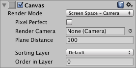

# Some of the best optimization tips for Unity UI

You’re sure to find a tip or two (or more) on this page to improve Unity UI performance. You’ll find many more in this great session by Unity engineer Ian Dundore, [Squeezing Unity: Tips for raising performance] (section on Unity UI starts at 23:38).

## 1. Divide up your canvases

**Problem: When one or more elements change on UI Canvas, it dirties the whole Canvas.**

[The Canvas] is the basic component of Unity UI. It generates meshes that represent the UI elements placed on it, regenerates the meshes when UI elements change, and issues draw calls to the GPU so that the UI is actually displayed.

Generating these meshes can be expensive. UI elements need to be collected into batches so that they’re drawn in as few draw calls as possible. Because batch generation is expensive, we want to regenerate them only when necessary. The problem is that, _when one or more elements change on a Canvas, the whole Canvas has to be re-analyzed to figure out how to optimally draw its elements._

Many users build their entire game’s UI in one single canvas with thousands of elements. So, when they change one element, they can experience a CPU spike costing multiple milliseconds (to hear more about why rebuilding is expensive, go to the 24:55 mark in Ian’s talk).

**Solution: Divide up your canvases.**

Each canvas is an island that isolates the elements on it from those of on other canvases. So, _slicing up your canvases in the main tool available for resolving batching problems with Unity UI._

You can also nest canvases, which allows designers to create large hierarchical UIs without having to think about where different things are onscreen across many canvases. Child canvases also isolate content, from both their parent and sibling canvases. They maintain their own geometry and perform their own batching.

When subdividing canvases with child canvases, try to group things based on when they get updated. For example, separate dynamic elements from static ones (at around 29:36, Ian provides a nice example of smart subdivision of canvases).

## 2. Optimal use of Graphic Raycaster

**Problem: Optimal use of the Graphic Raycaster:**

The [Graphic Raycaster] is the component that translates your input into UI Events. It translates screen/touch input into Events, and then sends them to interested UI elements. You need a Graphic Raycaster on every Canvas that requires input, including sub-canvases.

Despite its name the Graphic Raycaster is not really a raycaster: by default, it only tests UI graphics. It takes the set of UI elements that are interested in receiving input on a given canvas, and performs intersection checks: it checks that the point at which the input event occurs against the RectTransform of each UI element on the Graphic Raycaster’s Canvas is marked as interactive.

_The challenge is that not all UI elements are interested in receiving updates._

**Solution: Turn off the Raycast Target for static or non-interactive elements.**

For example, text on a button. Turning off the Raycast Target will directly reduce the number of intersection checks the Graphic Raycaster must perform each frame.

**Problem: In some ways, the Graphic Raycaster does act as a raycaster.**

If you set Render Mode on your Canvas to Worldspace Camera or Screen Space Camera, you can also set a blocking mask. The blocking mask determines whether the Raycaster will cast rays via 2D or 3D physics, to see if some physics object is blocking the user’s ability to interact with the UI.

**Solution: Casting rays via 2D or 3D physics can be expensive, so use this feature sparingly.**

Also, minimize the number of Graphic Raycasters by not adding them to non-interactive UI Canvases, since in this case, there is no reason to check for interaction events.

## 3. Avoid use of Camera.main

**Problem: World Space canvases need to know which camera their interaction events should come from.**

When setting up a Canvas to render either in World Space or in a Camera’s screen space, it’s possible to specify the Camera which will be used to generate interaction events for the UI’s Graphic Raycaster. This setting is required for “Screen Space - Camera” canvases, and is called the “Render Camera.”

However, the setting is optional for “World Space” canvases, and is called the “Event Camera.”

_If you leave the Event Camera field blank on a World Space Canvas, this does not mean that your Canvas will not receive Events. Instead, it uses the game’s main Camera._ To determine which Camera is the main Camera, it accesses the Camera.main property.

_Depending on the code path Unity takes, it will access Camera.main between 7-10 times per frame, per Graphic Raycaster, per World Space Canvas. And Camera.main calls Object.FindObjectWithTag every time it’s accessed!_ Obviously, this is not a good thing at runtime.

**Solution: Avoid the use of Camera.main.**

Cache references to Cameras, and create a system to track the main camera. _If you use World Space canvases, always assign an Event Camera. Do not leave this setting empty!_ If the Event Camera needs to change, write some code that will update the Event Camera property.

## 4. Avoid Layout Groups where possible

**Problem: Every UI element that tries to dirty its Layout will perform at least one GetComponents call.**

When one or more child elements change on a layout system, it gets dirtied. The changed child element(s) invalidate the Layout system that owns it.

A bit about Layout Systems: A Layout System is a set of contiguous Layout Groups that are directly above a Layout Element. A Layout Element is not just the Layout Element Component: UI images, texts and Scroll Rects–these are also Layout Elements. And, Scroll Rects are also Layout Groups.

Back to the problem: Every UI element that marks its layout as dirty will perform, at minimum, one GetComponents call. This call looks for a valid Layout Group on the Layout Element’s parent. If it finds one, it continues walking up the Transform hierarchy until it stops finding Layout Groups or reaches the hierarchy root–whichever comes first. Therefore, each Layout Group adds one GetComponents call to each child Layout Element’s dirtying process, making nested Layout Groups extremely bad for performance.

**Solution: Avoid Layout Groups wherever possible.**

Use anchors for proportional layouts. On hot UIs with a dynamic number of elements, consider writing your own code that will calculate layouts, and be sure to use this only on-demand, instead of with every single change.

## 5. Pool UI objects the smart way

**Problem: Pooling UI objects the wrong way around.**

Often, people pool UI objects by reparenting it and then disabling, but this causes unnecessary dirtying.

**Solution: Disable the object first, then reparent it into the pool.**

You will dirty the old hierarchy once, but then when you reparent it, you’ll avoid dirtying the old hierarchy a second time, and you won’t dirty the new hierarchy at all. If you are removing an object from the pool, reparent it first, then update your data, then enable it.

## 6. How to hide a Canvas

**Problem: How to hide a Canvas**

Sometimes, you want to hide some UI elements, and canvases. How you can do this most efficiently?

**Solution: Disable the Canvas Component itself**

Disabling the Canvas Component will stop the Canvas from issuing draw calls to the GPU, so the Canvas will not be visible any longer. However, the Canvas won’t discard its vertex buffer; it will keep all of its meshes and vertices, and when you re-enable it, it won’t trigger a rebuild, it will just start drawing them again.

Additionally, disabling the Canvas Component does not trigger the expensive OnDisable/OnEnable callbacks on the Canvas’ hierarchy. Just be careful to disable child Components that run expensive per-frame code.

#### 7Optimal use of animators on UI elements

**Problem: Using animators on your UI**

Animators will dirty their elements every frame, even if the value in the animation does not change. Animators have no no-op checks.

**Solution:**

Only put animators on dynamic elements that always change. For elements that rarely change or that only change in response to events, for a short period of time, write your own code or tweening system.

#### More resources

[Squeezing Unity: Tips for raising performance] (section on Unity UI starts at 23:38).  
[Best practices: Optimizing Unity UI]  
[Unity UI Docs]  
[UI Profiler]
[Building an easy to use menu system]

[Squeezing Unity: Tips for raising performance]: https://www.youtube.com/watch?v=_wxitgdx-UI&list=PLX2vGYjWbI0Rzo8D-vUCFVb_hHGxXWd9j&index=8
[The Canvas]: https://docs.unity3d.com/Packages/com.unity.ugui@2.0/manual/UICanvas.html
[Graphic Raycaster]: https://docs.unity3d.com/Packages/com.unity.ugui@2.0/manual/script-GraphicRaycaster.html
[Best practices: Optimizing Unity UI]: https://learn.unity.com/tutorial/optimizing-unity-ui
[Unity UI Docs]: https://docs.unity3d.com/Packages/com.unity.ugui@2.0/manual/index.html
[UI Profiler]: https://docs.unity3d.com/cn/current/Manual/ProfilerUI.html
[Building an easy to use menu system]: https://www.youtube.com/watch?v=wbmjturGbAQ&list=PLX2vGYjWbI0Rzo8D-vUCFVb_hHGxXWd9j&index=57&t=25s
