# SRP Batcher 加速渲染性能

[原文地址](https://unity.com/blog/engine-platform/srp-batcher-speed-up-your-rendering)

2018 年，我们推出了一种高度可定制的渲染技术，称为 [可编程渲染管线(SRP)](https://blog.unity.com/technology/srp-overview)。其中包含一个新的底层引擎渲染循环 SRP Batcher，可以将 CPU 渲染速度提升 1.2 到 4 倍(具体取决于场景)。让我们看看如何最好地使用这一功能！

https://youtu.be/pUM7ifjGKkM

这段视频展示了 Unity 最糟糕的情况：每个对象都是动态的且使用不同的材质(颜色、纹理)。这个场景展示了许多相似的网格，但如果每个对象使用不同的网格也会得到相同的结果(因此无法使用 GPU instancing)。在 PlayStation 4 上加速约为 4 倍(本视频为 PC，Dx11)。

*注意：当我们说 4 倍加速时，指的是 CPU 渲染代码("RenderLoop.Draw"和"ShadowLoop.Draw"分析器标记)。我们不是在讨论全局帧率(FPS)。*

## Unity 与材质

Unity 编辑器有一个非常灵活的渲染引擎。您可以在帧的任何时间修改任何材质属性。此外，过去的渲染架构是为非恒定缓冲区(non-constant buffers)设计的，支持 DirectX9 等图形 API。然而，这些优秀功能也有一些缺点。例如，当 DrawCall 使用新材质时需要进行大量工作。因此基本上，场景中的材质越多，设置 GPU 数据所需的 CPU 资源就越多。

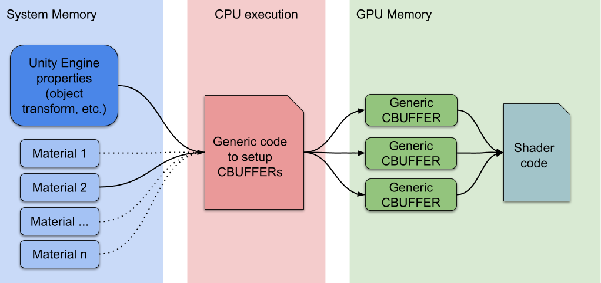
> 标准 Unity 渲染工作流

在内部渲染循环中，当检测到新材质时，CPU 会收集所有属性并在 GPU 内存中设置不同的常量缓冲区。GPU 缓冲区的数量取决于着色器如何声明其 CBUFFER。

## SRP Batcher 工作原理

当我们开发 SRP 技术时，必须重写一些底层引擎部分。我们看到了原生集成一些新范例(如 GPU 数据持久性)的绝佳机会。我们的目标是加速一般情况，即场景使用许多不同材质但很少着色器变体的情况。

现在，底层渲染循环可以使材质数据在 GPU 内存中持久化。如果材质内容没有变化，则无需设置和上传缓冲区到 GPU。此外，我们使用专用代码路径快速更新大型 GPU 缓冲区中的内置引擎属性。现在新的流程图如下：

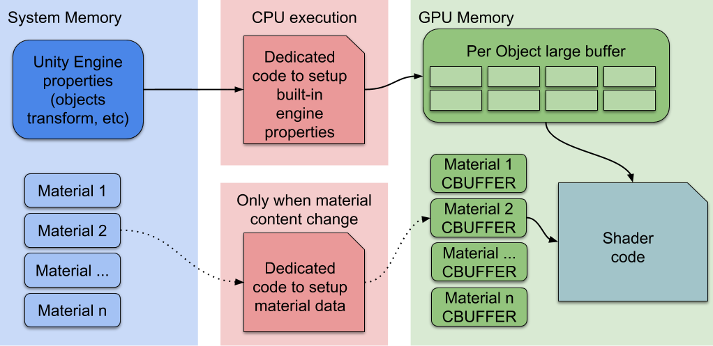
> SRP Batcher 渲染工作流

这里，CPU 只处理内置引擎属性，标记为对象矩阵变换。所有材质都有位于 GPU 内存中的持久 CBUFFER，随时可用。总结一下，加速来自两个不同方面：

* 每个材质内容现在持久保存在 GPU 内存中
* 专用代码管理大型 `per object` GPU CBUFFER

```
SRP Bacher 把同一种 shader 对应的材质球的材质，颜色放到一个缓冲区中，不用每帧设置给 GPU，每帧仅仅设置坐标、缩放、转换矩阵等变量给 GPU。

在过去的渲染架构中，Unity 采取对一个材质分配一个 CBuffer，这个 CBuffer 包括 shader 里显性的参数(自己定义的 uniform 参数)和隐性的参数(Unity 固定的 uniform modelMaterix，modelViewMartrix 等)，每一次的 DrawCall 都要更新这个 CBuffer。

在 SRP 的渲染架构中，Unity 采取了一个策略：对一个材质分配一个半 CBuffer，shader 的显性参数分配到了一个 CBuffer 里，shader 的隐性参数则是 N 个物体共享一个 CBuffer.

比如一个 shader 对应了 10 个物体，在 SRP 渲染架构中，一共分配了 11 个 CBuffer。10 个分别来村 10 个材质中的显性参数，然后分配一个大的共享 CBuffer，把这 10 个物体的 modelMatrix 这类隐性参数都放在一起。

这个策略为动静分离，材质的显性参数大部分是低频更新的，隐性部分是高频更新的。一次更新可以更新一片。

示例: 大型的共享 CBffer 和每个材质自己的 CBuffer 都有各自专门的代码进行更新，大部分情况下只需要更新大型共享 CBuffer，从而降低了一帧内的 SetPassCall 数目，和 GPUInstacing 相比，优于 ConstantBuffer 里不包含位置等信息(GPUInstance 是包含的)，仅包括了显性属性，所以一次 drawCall 无法渲染所有物体，所以 SRPBatcher 的 DrawCall 次数是没有降低的。而 GPUInstacing 需要相同的 Mesh 和材质球，条件更苛刻，但是可以降低 DrawCall。
```

## 如何启用 SRP Batcher

您的项目必须使用轻量级渲染管线(LWRP)、高清渲染管线(HDRP)或您自己的自定义 SRP。要在 HDRP 或 LWRP 中激活 SRP Batcher，只需使用 SRP Asset Inspector 中的复选框。

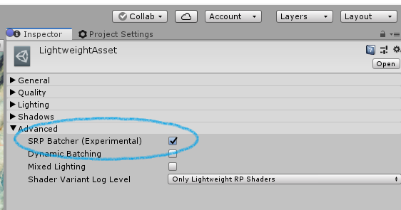
> 启用 SRP Batcher

如果您想在运行时启用/禁用 SRP Batcher 以进行性能基准测试，也可以使用 C# 代码切换此全局变量：

```cs
GraphicsSettings.useScriptableRenderPipelineBatching = true;
```

## SRP Batcher 兼容性

要使对象通过 SRP Batcher 代码路径渲染，有两个要求：

1. 对象必须是网格。不能是粒子或蒙皮网格。
2. 您必须使用与 SRP Batcher 兼容的着色器。HDRP 和 LWRP 中的所有 Lit 和 Unlit 着色器都符合此要求。

要使着色器与 SRP 兼容：

* 所有内置引擎属性必须在名为 `UnityPerDraw` 的单个 CBUFFER 中声明。例如 `unity_ObjectToWorld` 或 `unity_SHAr`。
* 所有材质属性必须在名为 `UnityPerMaterial` 的单个 CBUFFER 中声明。

您可以在 Inspector 面板中查看着色器的兼容性状态。仅当您的项目基于 SRP 时才会显示此兼容性部分。

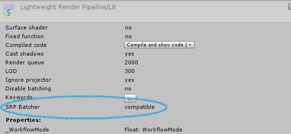
> SRP Batcher 兼容性

在任何给定场景中，有些对象与 SRP Batcher 兼容，有些不兼容。但场景仍能正确渲染。兼容对象将使用 SRP Batcher 代码路径，其他对象仍使用标准 SRP 代码路径。

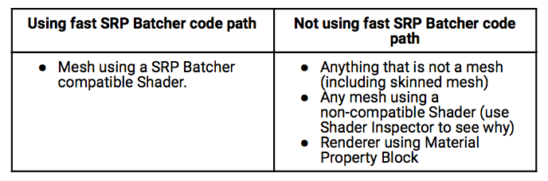

## 性能分析的艺术

`SRPBatcherProfiler.cs`

如果您想测量特定场景中 SRP Batcher 的速度提升，可以使用 `SRPBatcherProfiler.cs` C# 脚本。只需将脚本添加到场景中。当此脚本运行时，您可以使用 F8 键切换覆盖显示。您还可以在播放期间使用 F9 键打开/关闭 SRP Batcher。如果在 PLAY 模式(F8)中启用覆盖，您应该会看到许多有用信息：

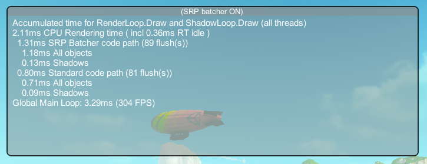

这里，所有时间均以毫秒(ms)为单位测量。这些时间测量显示 CPU 在 Unity SRP 渲染循环中花费的时间。

*注意：时间测量表示一帧中所有 "RenderLoop.Draw" 和 "Shadows.Draw" 标记的累积时间，无论线程所有者是谁。当您看到 "1.31ms SRP Batcher code path" 时，可能 0.31ms 花费在主线程上，1ms 分布在所有图形作业上。*

## 覆盖信息

在此表中，您可以看到 PLAY 模式中可见覆盖的每个设置的描述，从上到下：

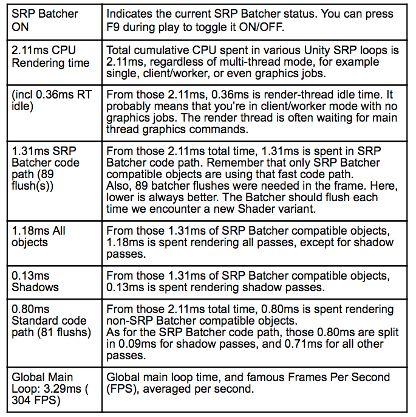

*注意：我们犹豫是否在覆盖底部添加 FPS，因为在优化时您应该非常小心 FPS 指标。首先，FPS 不是线性的，因此看到 FPS 增加 20% 并不能立即告诉您优化了多少场景。其次，FPS 是帧的全局指标。FPS(或全局帧时间)取决于渲染之外的许多其他因素，如 C# 游戏逻辑、物理、剔除等。*

您可以从 [GitHub 上的 SRP Batcher 项目模板](https://github.com/Unity-Technologies/SRPBatcherBenchmark.git) 获取 `SRPBatcherProfiler.cs`。

## 各种场景基准测试

以下是 Unity 场景截图，分别关闭和打开 SRP Batcher，以查看不同情况下的加速效果。

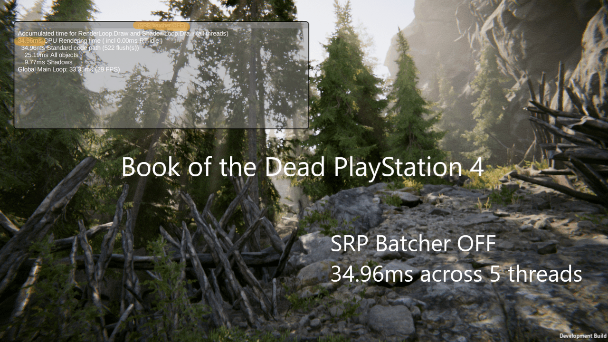

[Book of the Dead](https://unity.com/demos/book-of-the-dead)，HDRP，PlayStation 4。加速 1.47 倍。请注意 FPS 没有变化，因为此场景受 GPU 限制。您在 CPU 端还有 12ms 可用于其他操作。PC 上的加速几乎相同。

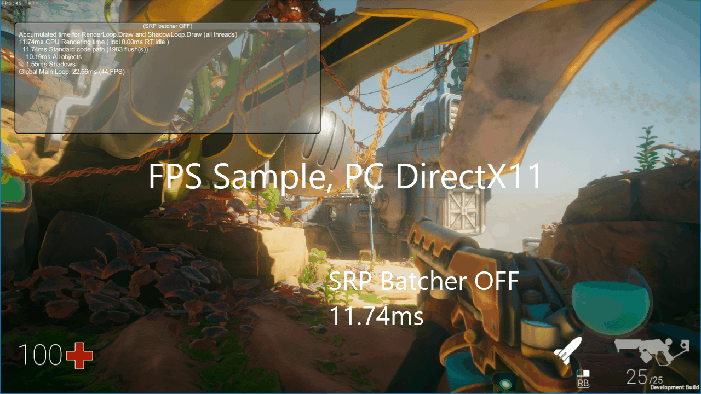

[FPS Sample](https://unity.com/fps-sample)，HDRP，PC DirectX 11。加速 1.23 倍。请注意仍有 1.67ms 用于标准代码路径，因为 SRP Batcher 不兼容。在这种情况下，蒙皮网格和一些使用材质属性块的粒子。

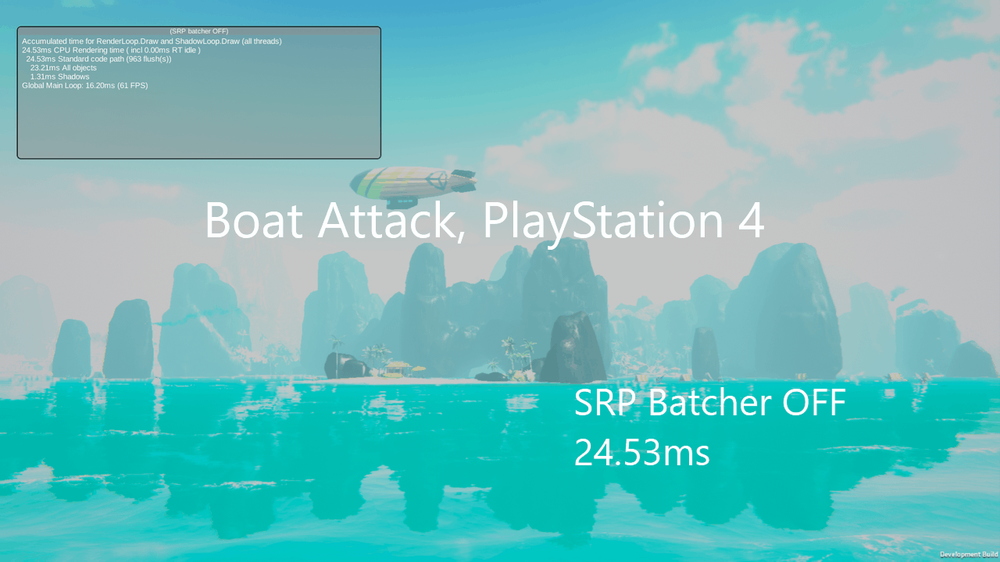

[Boat Attack](https://github.com/Verasl/BoatAttack)，LWRP，PlayStation 4。加速 2.13 倍。

## 支持的平台

SRP Batcher 几乎在所有平台上都能工作。下表显示平台和所需的最低 Unity 版本。Unity 2019.2 目前处于[开放 alpha](https://unity3d.com/unity/alpha/2019.2.0a4)阶段。

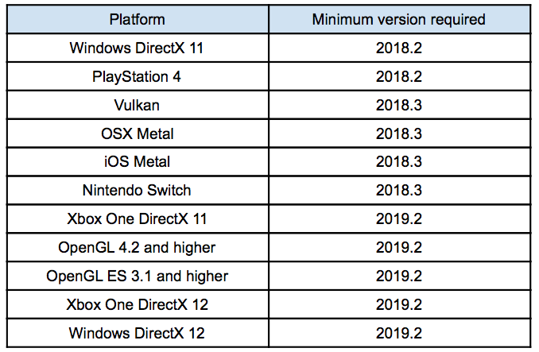

**关于 VR 的一些说明**

SRP Batcher 快速代码路径在 VR 中仅支持 `SinglePassInstanced` 模式。启用 VR 不会增加任何 CPU 时间(感谢 `SinglePassInstanced` 模式)

## 常见问题

**如何知道我是否以最佳方式使用 SRP Batcher？**

使用 `SRPBatcherProfiler.cs`，首先检查 SRP Batcher 是否开启。然后，查看 `Standard code path` 时间。这应该接近 0，所有时间都应花费在 `SRP Batcher code path` 上。有时，如果场景使用一些蒙皮网格或粒子，在 `Standard code path` 上花费一些时间是正常的。查看我们的 [GitHub 上的 SRP Batcher 基准测试项目](https://github.com/Unity-Technologies/SRPBatcherBenchmark.git)。

**无论 SRP Batcher 开启还是关闭，SRPBatcherProfiler 显示的时间都相似。为什么？**

首先，您应该检查几乎所有渲染时间是否都通过新代码路径(见上文)。如果是这样，并且数字仍然相似，那么查看 `flush` 数字。当 SRP Batcher 开启时，这个 `flush` 数字应该大幅下降。作为经验法则，除以 10 非常好，除以 2 也不错。如果 `flush` 计数没有大幅下降，意味着您仍然有许多着色器变体。尝试减少着色器变体的数量。如果您做了许多不同的着色器，尝试制作一个具有更多参数的 "超级" 着色器。然后使用许多不同的材质参数是免费的。

**启用 SRP Batcher 后全局 FPS 没有变化。为什么？**

检查以上两个问题。如果 `SRPBatcherProfiler` 显示 `CPU Rendering time` 快了两倍，而 FPS 没有变化，那么 CPU 渲染部分不是您的瓶颈。这并不意味着您不受 CPU 限制-相反，可能您使用了太多 C# 游戏逻辑或太多物理元素。无论如何，如果 `CPU Rendering time` 快了两倍，仍然是积极的。您可能已经注意到在顶部视频中，即使加速 3.5 倍，场景仍保持在 60FPS。这是因为我们开启了 VSYNC。SRP Batcher 确实在 CPU 端节省了 6.8ms。这些毫秒可用于其他任务。它也可以节省移动设备上的电池寿命。

## 如何检查 SRP Batcher 效率

理解 SRP Batcher 上下文中的 "批处理" 是什么很重要。传统上，人们倾向于减少 `DrawCall` 数量以优化 CPU 渲染成本。真正的原因是引擎在发出绘制之前必须设置很多东西。真正的 CPU 成本来自该设置，而不是来自 GPU DrawCall 本身(这只是推送到 GPU 命令缓冲区的一些字节)。SRP Batcher 不会减少 DrawCall 数量。它只是减少 DrawCall 之间的 GPU 设置成本。

您可以在以下工作流程中看到这一点：

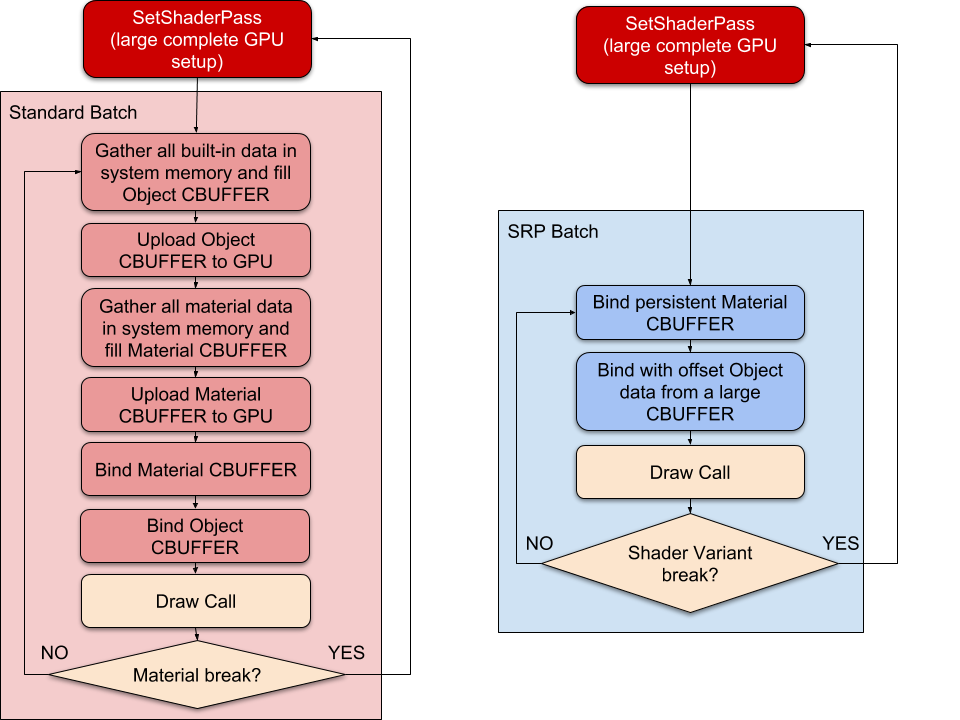

左侧是标准 SRP 渲染循环。右侧是 SRP Batcher 循环。在 SRP Batcher 上下文中，"批处理" 只是一系列"Bind"、"Draw"、"Bind"、"Draw"...GPU 命令。

在标准 SRP 中，缓慢的 SetShaderPass 为每个新材质调用。在 SRP Batcher 上下文中，SetShaderPass 为每个新着色器变体调用。

要获得最大性能，您需要尽可能保持这些批处理大。因此您需要避免任何着色器变体更改，但如果它们使用相同的着色器，可以使用任意数量的不同材质。

您可以使用 Unity Frame Debugger 查看 SRP Batcher "批处理" 长度。每个批处理都是帧调试器中称为 "SRP Batch" 的事件，如下所示：

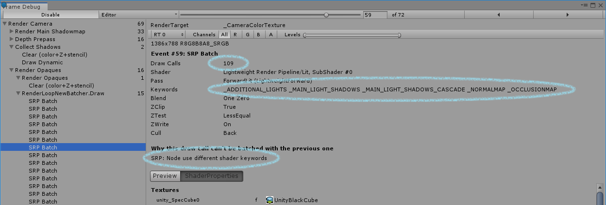

参见左侧的 SRP Batch 事件。另请参见批处理大小，即 Draw Calls 数量(此处为 109)。这是一个相当高效的批处理。您还可以看到前一个批处理中断的原因("Node use different shader keywords")。这意味着该批处理使用的着色器关键字与前一批处理中的关键字不同。这意味着着色器变体已更改，我们必须中断批处理。

在某些场景中，某些批处理大小可能非常低，如此处所示：

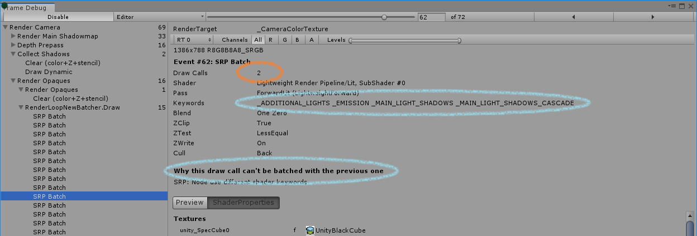

批处理大小仅为 2。这可能意味着您有太多不同的着色器变体。如果您正在创建自己的 SRP，请尝试编写具有最少关键字的通用"超级"着色器。您不必担心在 "property" 部分放入多少材质参数。

*注意：帧调试器中的 SRP Batcher 信息需要 Unity 2018.3 或更高版本。*

## 编写自己的兼容着色器的 SRP

*注意：本节适用于编写自己的可编程渲染循环和着色器库的高级用户。LWRP 或 HDRP 用户可以跳过此部分，因为我们提供的所有着色器都已与 SRP Batcher 兼容。*

如果您正在编写自己的渲染循环，您的着色器必须遵循一些规则才能通过 SRP Batcher 代码路径。

**`Per Material` 变量**

首先，所有 `Per Material` 数据应在名为 `UnityPerMaterial` 的单个 CBUFFER 中声明。什么是 `Per Material` 数据？通常是您在 `shader property` 部分声明的所有变量。即您的艺术家可以使用材质 GUI 检查器调整的所有变量。例如，让我们看一个简单的着色器：

```cs
Properties
{
  _Color1 ("Color 1", Color) = (1,1,1,1)
  _Color2 ("Color 2", Color) = (1,1,1,1)
}

float4 _Color1;
float4 _Color2;
```

如果您编译此着色器，着色器检查器面板将显示：

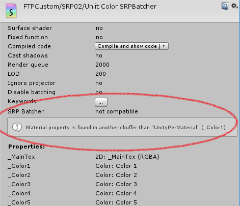

要解决这个问题，只需像这样声明所有 `per material` 数据：

```cs
CBUFFER_START(UnityPerMaterial)
float4 _Color1;
float4 _Color2;
CBUFFER_END
```

**`Per Object` 变量**

SRP Batcher 还需要一个非常特殊的名为 `UnityPerDraw` 的 CBUFFER。这个 CBUFFER 应包含所有 Unity 内置引擎变量。

`UnityPerDraw` CBUFFER 中变量的声明顺序也很重要。所有变量都应遵循我们称为 `Block Feature` 的布局。例如，"Space Position block feature" 应包含所有这些变量，按此顺序：

```cs
float4x4 unity_ObjectToWorld;
float4x4 unity_WorldToObject;
float4 unity_LODFade;
float4 unity_WorldTransformParams;
```

如果您不需要某些 block feature，可以不必声明它们。`UnityPerDraw` 中的所有内置引擎变量应为 `float4` 或 `float4x4`。在移动设备上，人们可能希望使用 `real4`(16 位编码的浮点值)来节省一些 GPU 带宽。并非所有 `UnityPerDraw` 变量都能使用 `real4`。请参考 "Could be real4" 列。

以下是描述 `UnityPerDraw` CBUFFER 中所有可能 block feature 的表格：

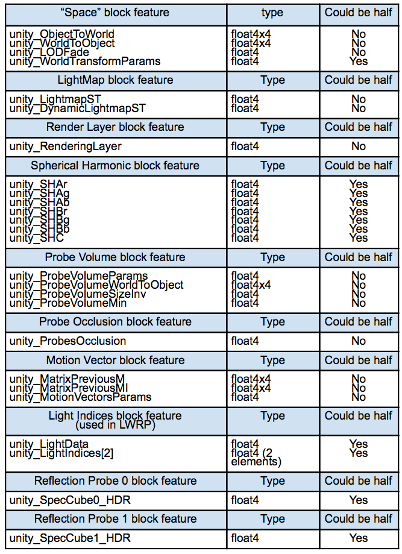

> 注意：如果一个 feature block 中的一个变量声明为 real4(half)，则该 feature block 的所有其他潜在变量也应声明为 real4。
> 
> 提示 1：始终在检查器中检查新着色器的兼容性状态。我们会检查几个潜在错误(UnityPerDraw 布局声明等)并显示为什么不兼容。
>
> 提示 2：在编写自己的 SRP 着色器时，可以参考 LWRP 或 HDRP 包查看它们的 UnityPerDraw CBUFFER 声明以获取灵感。

## 未来

我们仍在通过在某些渲染通道(特别是阴影和深度通道)中增加批处理大小来改进 SRP Batcher。

我们还在努力添加与 SRP Batcher 一起使用的自动 GPU instancing。我们从新的 [DOTS](https://blog.unity.com/technology/dots-c-c) 渲染器开始，该渲染器用于我们的 [MegaCity 演示](https://www.youtube.com/watch?v=j4rWfPyf-hk)。在 Unity 编辑器中的加速效果相当惊人，从 10 FPS 提升到 50 FPS。

在编辑器中使用 SRP Batcher 和 DOTS 渲染器的 MegaCity。性能差异如此之大，以至于全局帧速率提高了五倍。

> 注意：准确地说，启用 SRP Batcher 时的这种巨大加速仅限于编辑器，因为编辑器当前不使用图形作业。独立播放器模式中的加速约为 x2。

编辑器中的 MegaCity。如果您能以 60hz 播放视频，您会感受到启用 SRP Batcher 时的速度提升。  

> 注意：带有 DOTS 渲染器的 SRP Batcher 仍处于实验阶段，正在积极开发中。
