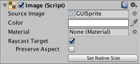
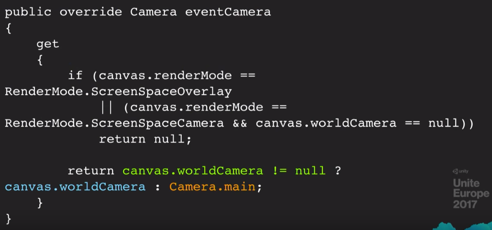

# Unity UI 优化建议

[原文地址 - UnityLearn](https://create.unity.com/Unity-UI-optimization-tips)

本文汇集了提升 Unity UI 性能的最佳实践技巧。更多详细内容可参考 Unity 工程师 Ian Dundore 的精彩演讲 [Squeezing Unity: Tips for raising performance]（UI 优化部分从 23:38 开始）。

## 合理划分 Canvas

**问题：当 UI Canvas 上的元素发生变化时，会导致整个 Canvas 重新计算。**

[Canvas] 是 Unity UI 的基础组件。它生成代表 UI 元素的网格(Mesh)，当 UI 元素变化时需要重新生成网格(Mesh)，并向 GPU 发出绘制调用以显示 UI。

网格(Mesh)生成可能很耗性能。需要批量处理 UI 元素以减少绘制调用次数(Draw Call)。由于批量生成(Batch Generation)很昂贵，我们希望只在必要时才重新生成。问题是，当 Canvas 上的元素发生变化时，整个 Canvas 都需要重新分析以确定如何最优绘制其元素。

许多用户在一个 Canvas 中构建整个游戏的 UI，包含数千个元素。因此当他们改变一个元素时，可能会导致 CPU 峰值消耗数毫秒（关于为什么重建很昂贵，可参考 Ian 演讲中 24:55 处的内容）。

**解决方案：合理划分 Canvas。**

每个 Canvas 都是一个孤岛，将其上的元素与其他 Canvas 隔离。因此，划分 Canvas 是解决 Unity UI 批处理问题的主要方法。

你也可以嵌套 Canvas，这样设计师可以创建大型层级化 UI 而无需考虑多个 Canvas 之间的屏幕位置关系。子 Canvas 也会将其内容与父 Canvas 和兄弟 Canvas 隔离。它们维护自己的几何体并执行自己的批处理。

当使用子 Canvas 划分时，尝试根据更新频率对元素进行分组。例如，将动态元素与静态元素分开（在 29:36 处，Ian 提供了一个很好的 Canvas 智能划分示例）。

## Graphic Raycaster 的最佳使用

**问题：Graphic Raycaster 的最佳使用方式**

[Graphic Raycaster] 是将输入转换为 UI 事件的组件。它将屏幕/触摸输入转换为事件，然后发送给感兴趣的 UI 元素。每个需要输入的 Canvas（包括子 Canvas）都需要一个 Graphic Raycaster。

尽管名字叫 Raycaster，但 Graphic Raycaster 实际上并不进行射线检测：默认情况下，它只测试 UI 图形。它获取 Canvas 上所有对输入感兴趣的 UI 元素集合，并执行相交检查：检查输入事件发生点是否与每个 UI 元素的 RectTransform 相交，且该元素被标记为可交互。

挑战在于并非所有 UI 元素都需要接收更新。

**解决方案：关闭静态或非交互元素的 Raycast Target。**

例如按钮上的文本。关闭 Raycast Target 将直接减少 Graphic Raycaster 每帧需要执行的相交检查次数。



**问题：在某些情况下，Graphic Raycaster 确实会进行射线检测。**

如果将 Canvas 的 Render Mode 设置为 Worldspace Camera 或 Screen Space Camera，你还可以设置一个 blocking mask。blocking mask 决定 Raycaster 是否会通过 2D 或 3D 物理系统投射射线，以判断是否有物理对象阻挡用户与 UI 的交互。

**解决方案：通过 2D 或 3D 物理系统投射射线可能很昂贵，应谨慎使用此功能。**

此外，通过不为非交互式 UI Canvas 添加 Graphic Raycaster 来最小化其数量，因为在这种情况下没有理由检查交互事件。

## 避免使用 Camera.main

**问题：World Space Canvas 需要知道交互事件应该来自哪个相机。**

当设置 Canvas 以 World Space 或 Screen Space 渲染时，可以指定用于为 UI 的 Graphic Raycaster 生成交互事件的 Camera。这个设置对于 `Screen Space - Camera` Canvas 是必需的，称为 `Render Camera`。


然而，对于 `World Space` Canvas 这个设置是可选的，称为 `Event Camera`。


如果在 World Space Canvas 上留空 Event Camera 字段，并不意味着你的 Canvas 不会接收事件。相反，它会使用游戏的主 Camera。 为了确定哪个 Camera 是主 Camera，它会访问 `Camera.main` 属性。



根据 Unity 采用的代码路径，每个 Graphic Raycaster、每个 World Space Canvas 每帧会访问 Camera.main 7-10 次。而 Camera.main 每次被访问时都会调用 Object.FindObjectWithTag！显然，这在运行时不是好事。

**解决方案：避免使用 Camera.main。**

缓存 Camera 引用，并创建一个系统来跟踪主相机。如果使用 World Space Canvas，总是分配一个 Event Camera。不要留空这个设置！如果 Event Camera 需要改变，编写代码来更新 Event Camera 属性。

## 尽可能避免使用 Layout Group

**问题：每个试图标记其 Layout 为脏的 UI 元素至少会执行一次 GetComponents 调用。**

当布局系统中的子元素发生变化时，布局系统会被标记为脏。变化的子元素会使拥有它的 Layout System 失效。

关于 Layout System：Layout System 是一组连续的 Layout Group，它们直接位于 Layout Element 之上。Layout Element 不仅仅是 Layout Element 组件：UI 图像、文本和 Scroll Rect 也都是 Layout Element。而且，Scroll Rect 也是 Layout Group。

回到问题：每个标记其布局为脏的 UI 元素至少会执行一次 GetComponents 调用。这个调用会在 Layout Element 的父对象上寻找有效的 Layout Group。如果找到一个，它会继续沿着 Transform 层级向上查找，直到找不到 Layout Group 或到达层级根节点。因此，每个 Layout Group 都会为每个子 Layout Element 的脏标记过程增加一个 GetComponents 调用，使得嵌套的 Layout Group 对性能极为不利。

```csharp
// LayoutElement.cs
protected void SetDirty()
{
    if(!IsActive())
        return;
    LayoutRebuilder.MarkLayoutForRebuild(transform as RectTransform);
}

// LayoutRebuilder.cs
public static void MarkLayoutForRebuild(RectTransform rect)
{
    if(rect == null || rect.gameObject == null)
        return;
        
    var comps = ListPool<Component>.Get();
    bool validLayoutGroup = true;
    RectTransform layoutRoot = rect;
    var parent = layoutRoot.parent as RectTransform;
    
    while(validLayoutGroup && !(parent == null || parent.gameObject == null))
    {
        validLayoutGroup = false;
        parent.GetComponents(typeof(ILayoutGroup), comps);
        
        for(int i = 0; i < comps.Count; ++i)
        {
            var cur = comps[i];
            if(cur != null && cur is Behaviour && ((Behaviour)cur).isActiveAndEnabled)
            {
                validLayoutGroup = true;
                layoutRoot = parent;
                break;
            }
        }
        parent = parent.parent as RectTransform;
    }
    
    // We know the layout root is valid if it's not the same as the rect,
    // since we checked that above. But if they're the same we still need to check.
    if(layoutRoot == rect && !ValidController(layoutRoot, comps))
    {
        ListPool<Component>.Release(comps);
        return;
    }
    
    MarkLayoutRootForRebuild(layoutRoot);
    ListPool<Component>.Release(comps);
}
```

**解决方案：尽可能避免使用 Layout Group。**

使用锚点进行比例布局。对于元素数量动态变化的热门 UI，考虑编写自己的布局计算代码，并确保只在需要时使用，而不是在每次变化时都使用。

## 正确使用 UI 对象缓存池

**问题：以错误的方式使用 UI 对象缓存池。**

通常，人们通过重新设置父对象然后禁用使 UI 对象回到对象池，但这会导致不必要的脏标记。

**解决方案：先禁用对象，然后将其重新设置父对象添加到缓存池中。**

你会脏标记旧层级一次，但当你重新设置父对象时，可以避免第二次脏标记旧层级，而且根本不会脏标记新层级。如果要从池中取出对象，先重新设置父对象，然后更新数据，最后启用它。

## 如何隐藏 Canvas

**问题：如何隐藏 Canvas**

有时你想隐藏一些 UI 元素和 Canvas。如何最高效地做到这一点？

**解决方案：禁用 Canvas 组件本身**

禁用 Canvas 组件将停止 Canvas 向 GPU 发出绘制调用，因此 Canvas 将不再可见。然而，Canvas 不会丢弃其顶点缓冲区；它会保留所有网格和顶点，当你重新启用它时，不会触发重建，只会重新开始绘制它们。

此外，禁用 Canvas 组件不会在 Canvas 层级上触发昂贵的 OnDisable/OnEnable 回调。只需小心禁用运行昂贵每帧代码的子组件。

## 在 UI 元素上优化使用 Animator

**问题：在 UI 上使用 Animator**

Animator 每帧都会脏标记其元素，即使动画中的值没有变化。Animator 没有无操作检查。

**解决方案：**

只在总是变化的动态元素上使用 Animator。对于很少变化或只在事件响应中短时间变化的元素，编写自己的代码或补间系统。

## 更多资源

* [Squeezing Unity: Tips for raising performance]（UI 优化部分从 23:38 开始）。  
* [Best practices: Optimizing Unity UI](./Unity%20UI%20优化.md)
* [Unity UI Docs](https://docs.unity3d.com/Packages/com.unity.ugui@2.0/manual/index.html)
* [UI Profiler](https://docs.unity3d.com/cn/current/Manual/ProfilerUI.html)
* [Building an easy to use menu system](https://www.youtube.com/watch?v=wbmjturGbAQ&list=PLX2vGYjWbI0Rzo8D-vUCFVb_hHGxXWd9j&index=57&t=25s)

[Squeezing Unity: Tips for raising performance]: https://www.youtube.com/watch?v=_wxitgdx-UI&list=PLX2vGYjWbI0Rzo8D-vUCFVb_hHGxXWd9j&index=8
[Canvas]: https://docs.unity3d.com/Packages/com.unity.ugui@2.0/manual/UICanvas.html
[Graphic Raycaster]: https://docs.unity3d.com/Packages/com.unity.ugui@2.0/manual/script-GraphicRaycaster.html