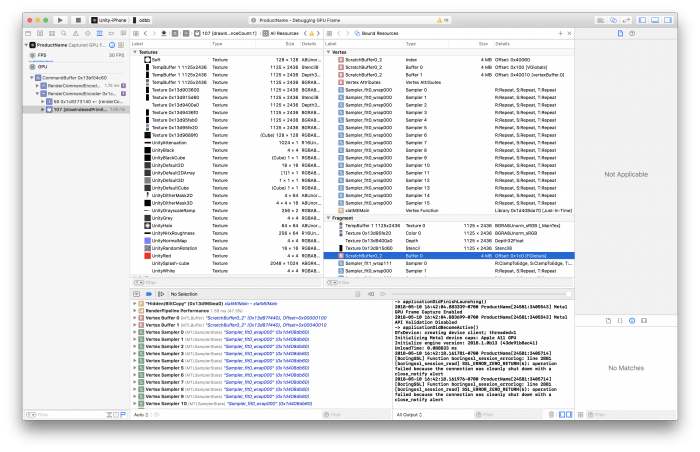
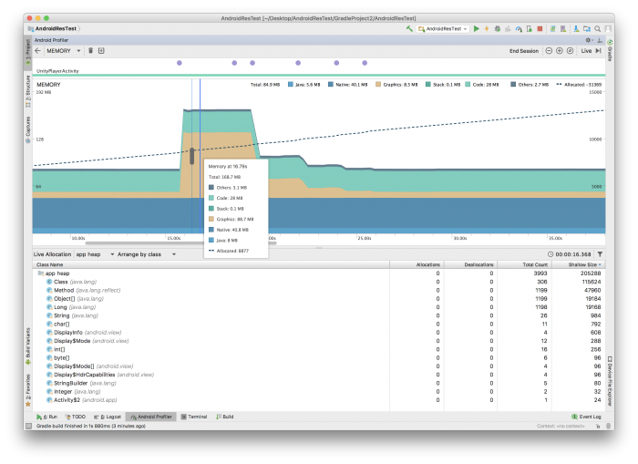

# Unity 中的内存管理

[原文地址 - UnityLearn](https://learn.unity.com/tutorial/memory-management-in-unity)

## 概述

在 Unity 中进行恰当的内存管理可能具有挑战性。你需要考虑自动内存管理的细微差别，理解原生内存(native memory)和托管内存(managed memory)之间的区别，以及内存在不同平台上的行为方式。本指南的目标是为你提供必要的知识，以便在任何公开可用的平台上分析和优化内存消耗。

## 重要文档

理解托管堆(managed heap)对于 Unity 中的内存管理至关重要。有关分析托管内存和如何优化内存的更多信息，请参阅 Unity 手册中 [理解优化](https://docs.unity3d.com/Manual/analysis.html) 下的 [托管内存部分](https://docs.unity3d.com/Manual/performance-managed-memory.html)。

> [Unity 2022.3 手册笔记](./Unity%20中的内存.md)

## 资源(Assets)

资源(Assets)在运行时会对原生内存和托管内存产生影响。Unity 运行时引擎在用户终止应用程序之前不会将托管内存返回给操作系统以供重用。如果托管堆变得过于碎片化，它会增长，然后耗尽可用内存。由于这种不可预测的行为，了解资源如何占用托管内存至关重要：

* 使用 `Destroy(myObject)` 来销毁一个 [Object](https://docs.unity3d.com/ScriptReference/Object.Destroy.html) 并释放其内存。将对 Object 的引用设置为 null 并不会销毁它。
* 将持久(长期)对象设置为类(classes)，将短暂(短期)对象设置为结构体(structs)。结构体不会在堆上分配，因此不会被垃圾回收(garbage-collected)。
* 重复使用临时工作缓冲区以保持临时垃圾(temporary garbage)较低，而不是频繁分配。
* 记住，枚举器(Enumerator)在退出之前不会清理其内存。

避免 [永不停止的协程(coroutines)](https://docs.unity3d.com/Manual/coroutines.html)，尤其是在分配大量托管内存时，因为协程会一直占用堆上的栈分配(stack allocations)，直到它们结束。

## 脚本后端(Scripting backends)

在 iOS 和 Android 上，可以在 Player Settings 中选择 Mono 或 IL2CPP 脚本后端。要更改脚本后端，请转到 Player Settings 窗口(Edit > Project Settings > Player)，向下滚动到 Other Settings 部分，然后从 Scripting Backend 下拉菜单中选择 Mono 或 IL2CPP。

注意：从 2017.3 版本开始，可以选择 [IL2CPP](https://docs.unity3d.com/Manual/IL2CPP.html) 脚本后端或 Mono 脚本后端。然而，WebGL 和 UWP 只支持 IL2CPP。iOS 仍然支持 Mono 脚本后端以实现快速迭代，但你不能再向 Apple 提交 Mono(32 位)应用程序了。

**不同脚本后端的优缺点**

每个脚本后端都有优缺点，这应该会影响你决定哪种是适合你情况的选择：

IL2CPP

* 与 Mono 相比，代码生成得到了极大的改进。
* 可以从头到尾在 C++ 中调试脚本代码。
* 可以启用 [引擎代码剥离(Engine code stripping)](https://unity3d.com/learn/tutorials/topics/best-practices/il2cpp-mono#Code%20stripping%20in%20Unity) 以减小代码大小。
* 构建时间比 Mono 长。
* IL2CPP 只支持 [提前编译(Ahead of Time (AOT))](https://docs.unity3d.com/Manual/ScriptingRestrictions.html)。

Mono

* 构建时间比 IL2CPP 快。
* 由于即时编译(Just In Time compilation (JIT))，支持更多托管库。
* 支持运行时代码执行。
* 必须随应用程序一起发布托管程序集(managed assemblies)(Mono 或 .NET 生成的 .dll 文件)。

提示：使用 IL2CPP 来开发和发布你的项目。如果使用 IL2CPP 导致迭代时间过慢，可以在开发期间暂时切换到 Mono 脚本后端以提高迭代速度。

注意：Player Settings 中的默认目标架构(target architectures)针对发布版本进行了优化。在开发期间使用此默认设置会增加你的构建时间，因为 Unity 会为每个选定的目标架构构建二进制文件，如下所示：

* Android Player Settings 中的默认目标架构是 armv7 和 x86，使用 IL2CPP 和 Mono 脚本后端。
* iOS Player Settings 中的默认架构是 armv7 和 arm64，使用 IL2CPP 脚本后端。

## Unity 中的代码剥离(Code stripping)

代码大小直接影响磁盘空间和运行时内存。重要的是要注意，Unity 会从代码库中移除任何你未使用的代码路径。Unity 在构建期间会自动剥离代码，在两个不同的级别上工作：

* 托管代码剥离(Managed code stripping)
* 原生代码剥离(Native code stripping)

### 托管代码剥离

Unity 在 [方法级别(method level)](https://docs.unity3d.com/ScriptReference/StrippingLevel.StripAssemblies.html) 剥离托管代码。要更改剥离级别，请转到 Player Settings 窗口，向下滚动到 Other Settings 部分，找到 `Managed Stripping Level` 下拉菜单并选择 Strip Assemblies。
> Project Settings > Player > Other Settings > Optimization > Managed Stripping Level

UnityLinker 会从 [中间语言(Intermediate Language (IL))](https://en.wikipedia.org/wiki/Common_Intermediate_Language) 中移除未使用的类型(类、结构体等)。即使你使用了某个类型，UnityLinker 也会移除该类型中未使用的方法。

注意：虽然此功能在使用 Mono 脚本后端的构建中是可选的，但在使用 IL2CPP 脚本后端的构建中始终启用。

### 原生代码剥离

Unity 在 Player Settings 中默认启用 `Strip Engine Code`，并启用原生代码剥离。启用 `Strip Engine Code` 以移除原生 Unity 引擎代码中未使用的模块和类。禁用 `Strip Engine Code` 以保留原生 Unity 引擎代码中的所有模块和类。

注意：对于公开可用的平台，原生代码剥离仅在 iOS、WebGL 和 Android 上受支持。

Unity 2017.3 及更高版本支持 Android 上的原生代码剥离；在早期版本中，Unity Android 运行时作为预链接的 `.so` 库发布，Unity 无法剥离。2017.3 中发布的 Android 运行时是一个静态引擎代码库，允许进行原生代码剥离。最终链接发生在构建期间，这最终导致构建时间略长。

### Unity 模块剥离(Unity Module Stripping)

注意：WebGL 是目前唯一支持剥离未使用 Unity 模块的平台。

Unity 会尽最大努力消除所有未使用的 Unity 模块。这意味着如果任何场景或脚本引用了你包含在构建中的 Unity 模块中的组件，Unity 不会剥离该模块。Unity 不会剥离核心模块，例如 Camera、AssetBundle、Halo 等。

**在空项目中剥离 WebGL 模块**

移除模块可以节省大量内存。例如，Unity 中最大的模块之一是 Physics 模块，它占用了大约 5MB 的 gzipped ASM.js 代码。如果你从一个空项目中移除 Physics 模块，构建大小会从 17MB 减少到 12MB。

### C# 代码剥离

UnityLinker 遵循基本的标记清除(mark and sweep)原则，类似于垃圾回收器。UnityLinker 会构建一个包含构建中每个程序集中的每个类型和方法的映射。UnityLinker 会将许多类型和方法标记为“根”(roots)，然后 UnityLinker 会遍历类型和方法之间的依赖关系图。

例如，如果一个类型的某个方法调用了另一个类型的某个方法，那么 UnityLinker 会将这个被调用的类型和方法标记为正在使用。一旦 UnityLinker 标记了所有根的依赖关系，系统会重新编织程序集，省略未标记为使用的方法或整个类型。

## 根(Roots)

如果 UnityLinker 的内部类在场景中或 Resources 中的内容中使用，UnityLinker 会将它们标记为根。类似地，UnityLinker 会将用户程序集中的所有类型和方法标记为根。

如果你在场景中或包含在 Resources 中的资源中直接使用其他程序集中的类型和方法，Unity 会将这些标记为根。

使用 [link.xml](https://docs.unity3d.com/Manual/IL2CPP-BytecodeStripping.html) 文件将其他类型和方法标记为根。如果你的项目使用 AssetBundles，使用 [BuildPlayerOption.assetBundleManifestPath](https://docs.unity3d.com/ScriptReference/BuildPlayerOptions-assetBundleManifestPath.html) 将其他类型和方法标记为根。

**用户程序集(User Assemblies)**

用户程序集是 Unity 从 Assets 文件夹中的松散代码生成的程序集。Unity 将大多数 C# 代码放在 `Assembly-CSharp.dll` 中；而 Unity 将 `/Assets/Standard Assets/` 或 `/Assets/Plugins/` 中的代码放在 `Assembly-CSharp-firstpass.dll` 中，这也被视为用户程序集。

如果代码库中有很大一部分类型或方法未使用，你可以通过将稳定代码迁移到预构建的程序集中并允许 UnityLinker 剥离它们来节省一些二进制大小和构建时间。使用 [Assembly Definition Files](https://unity3d.com/learn/tutorials/topics/best-practices/il2cpp-mono#Assembly%20Definition%20Files) 将稳定代码迁移到预构建的程序集中。

## 泛型共享(Generic Sharing)

对于引用类型，IL2CPP 生成的实现(C++ 代码)可以在使用引用类型的泛型之间共享。然而，IL2CPP 不会共享值类型，因为 IL2CPP 需要为每种类型单独生成代码。这会导致你的代码大小增加。

一般来说，应该不会有明显的性能差异，但这取决于具体情况以及需要优化什么。类通常在堆上，而结构体在栈上(有一些例外，例如协程)。对于内存性能和使用，这很重要。使用非引用类型会导致其他问题。你必须复制使用值类型的函数参数以影响性能。有关更多信息，请参阅这篇博客文章：[功能预览：Unity 2022.1 beta 中的 IL2CPP 完全泛型共享](https://blog.unity.com/engine-platform/il2cpp-full-generic-sharing-in-unity-2022-1-beta)。

## 程序集定义文件(Assembly Definition Files)

[程序集定义文件](https://blogs.unity3d.com/2017/11/22/unity-2017-3b-feature-preview-assembly-definition-files-and-transform-tool/) 允许你定义自定义托管程序集，并按文件夹将用户脚本分配给它们。反过来，这会加快迭代时间，因为 Unity 只会构建那些实际受到脚本更改影响的程序集。

注意：虽然多个程序集确实提供了模块化，但它们也会增加应用程序的二进制大小和运行时内存。测试表明，每个程序集可使可执行文件增加多达 4KB。

## 构建报告(Build Report)

[构建报告](https://docs.unity3d.com/ScriptReference/Build.Reporting.BuildReport.html) 是一个包含在 Unity 中但没有 UI 的 API。构建项目会生成一个 buildreport 文件，其中显示了最终可执行文件中剥离了什么以及为什么剥离。

要预览剥离信息：

* 构建你的项目。
* 保持编辑器打开。
* 连接到 [http://files.unity3d.com/build-report/](http://files.unity3d.com/build-report/)。

注意：你可能需要 [启用预览包](https://docs.unity3d.com/Manual/class-PackageManager.html) 才能在 Package Manager 中找到此工具。

构建报告工具连接到你正在运行的 Unity 编辑器，下载并呈现构建报告的详细信息。

可以使用 binary2text 工具处理 Library/LatestBuild.buildreport 中生成的文件，以查看报告中的数据。[Binary2text](https://support.unity3d.com/hc/en-us/articles/217123266-How-do-I-determine-what-is-in-my-Scene-bundle-) 随 Unity 一起发布，在 Mac 上位于 `Unity.app/Contents/Tools/`，在 Windows 上位于 `Unity/Editor/Data/Tools/`。

## 原生内存(Native memory)

原生内存是优化应用程序的关键组成部分，因为大多数引擎代码都在常驻内存(resident memory)中。当你将代码集成到原生插件中时，你可以直接控制它，但并不总是能够控制和优化 Unity 内部系统的原生内存消耗。内部系统使用不同的缓冲区和资源，并且可能并不总是清楚这如何影响内存消耗。此步骤详细介绍了 Unity 内部系统并解释了你在原生分析器中经常看到的内存数据。

Unity 使用许多不同的原生分配器和缓冲区。有些是持久的，例如常量缓冲区，而有些是动态的，例如后备缓冲区(back buffer)。以下小节描述了缓冲区及其行为。

**暂存区(Scratchpad)**

Unity 将常量存储在 4MB 的缓冲区池中，并在帧之间循环使用该池。该池在其生命周期内绑定到 GPU，并在 XCode 或 Snapdragon 等帧捕获工具中显示。



**块分配器(Block allocator)**

Unity 在某些内部系统中使用块分配器。每当 Unity 需要分配新的内存页块时，都会产生内存和 CPU 开销。通常，页的块大小足够大，以至于分配只在 Unity 第一次使用某个系统时出现。第一次分配后，页块会被重用。内部系统使用块分配器的方式存在细微差异。

**AssetBundles**

第一次加载 AssetBundle 时，需要额外的 CPU 和内存开销，因为块分配器会启动，允许 Asset Bundle 系统分配第一个内存页块。

Unity 会重用 AssetBundle 系统分配的页面，但如果你想一次加载许多 AssetBundles，可能需要分配第二个或第三个块。所有这些都会一直分配，直到应用程序终止。

**Resources**

Resources 使用与其他系统共享的块分配器，因此第一次从 Resources 加载资源时没有 CPU 或内存开销(因为它在启动期间已经发生过)。

**环形缓冲区(Ring buffer)**

Unity 使用环形缓冲区将纹理推送到 GPU。你可以通过 [QualitySettings.asyncUploadBufferSize](https://docs.unity3d.com/ScriptReference/QualitySettings-asyncUploadBufferSize.html) 调整此异步纹理缓冲区。

注意：Unity 分配环形缓冲区内存后，无法将其返回给系统。

**资源(Assets)**

资源在运行时会对原生内存和托管内存产生影响。除了托管内存，Unity 在不再需要时会将原生内存返回给操作系统。由于每个字节都很重要——尤其是在移动设备上——你可以尝试以下方法来减少原生运行时内存：

* 从网格中移除未使用的通道。
* 从动画中移除冗余的关键帧。
* 在 Quality Settings 中使用 [maxLOD](https://docs.unity3d.com/Manual/class-QualitySettings.html) 从构建中移除 [LODGroups](https://docs.unity3d.com/Manual/LevelOfDetail.html) 中更高细节的网格。
* 构建后检查 [Editor.log](https://docs.unity3d.com/Manual/LogFiles.html)，确保磁盘上每个资源的大小与其运行时内存使用量成比例。
* 通过在 Quality Settings 的 Rendering 部分使用 Texture Quality 设置强制使用较低的纹理分辨率(通过 mipmaps)来减少上传到 GPU 内存的内存。
* 法线贴图(Normal maps)无需与漫反射贴图(diffuse maps)大小相同(1:1)，因此你可以使用较低分辨率的法线贴图，同时仍能实现高视觉保真度并节省内存和磁盘空间。

请注意，由于托管堆的严重碎片化，托管内存问题通常会超过原生内存问题。

**克隆材质(Cloned Materials)**

注意克隆材质，因为访问任何渲染器(renderer)的 material 属性会导致材质被克隆，即使没有分配任何东西。这个克隆的材质不会被垃圾回收，只有在你更改场景或调用 [Resources.UnloadUnusedAssets()](https://docs.unity3d.com/ScriptReference/Resources.UnloadUnusedAssets.html) 时才会被清除。如果你想访问只读材质，可以使用 customRenderer.sharedMaterial。

**卸载场景(Unloading Scenes)**

调用 [UnloadScene()](https://docs.unity3d.com/ScriptReference/SceneManagement.SceneManager.UnloadSceneAsync.html) 以销毁和卸载与场景关联的 GameObjects。

注意：这不会卸载关联的资源。为了卸载资源并释放托管内存和原生内存，在场景卸载后调用 [Resources.UnloadUnusedAssets()](https://docs.unity3d.com/ScriptReference/Resources.UnloadUnusedAssets.html)。

## 音频(Audio)

**虚拟声音(Virtual Voices)**

Unity 根据平台的 [实时可听度(real time audibility)](https://www.fmod.com/docs/api/content/generated/overview/virtualvoices.html) 动态地将声音设置为虚拟或真实。例如，Unity 将播放距离较远或音量较低的声音设置为虚拟，但如果这些声音靠近或变响，则会将其更改为真实声音。Audio Settings 中的默认值对于移动设备来说是很好的值。

|     | **最大虚拟声音数(Max Virtual Voice Count)** | **最大真实声音数(Max Real Voice Count)** |
| :--- | :--- | :--- |
| 默认 | 512 | 32  |
| 最大 | 4095 | 255 |

**DSP 缓冲区大小(DSP Buffer Size)**

Unity 使用 DSP 缓冲区大小来控制 [混音器延迟(mixer latency)](https://www.fmod.com/docs/api/content/generated/FMOD_System_SetDSPBufferSize.html)。底层音频系统 [FMOD](https://www.fmod.com/) 定义了平台相关的 DSP 缓冲区大小。缓冲区大小影响延迟，应谨慎处理。延迟等于样本数乘以缓冲区数。缓冲区数 [默认为](https://www.fmod.com/docs/api/content/generated/FMOD_System_SetDSPBufferSize.html) 4。Unity 中的音频系统使用以下样本数作为 Unity 中 Audio Settings 的值：

* 默认：
  * iOS 和桌面：1024
  * Android：512
* 最佳延迟：256
* 良好延迟：512
* 最佳性能：1024

**音频导入设置(Audio Import Settings)**

使用正确的设置可以节省运行时内存和 CPU 性能。

* 如果音频文件不需要立体声，请启用 Force to mono 选项。这样做会减少运行时内存和磁盘空间。这主要用于带有单声道扬声器的移动平台。
* 较大的 AudioClip 应设置为 Streaming。Unity 5.0 及更高版本中的 Streaming 有[ 200KB 的开销](https://docs.unity3d.com/Manual/class-AudioClip.html)，因此应将小于 200KB 的音频文件设置为 Compressed into Memory。
* 对于较长的剪辑，将 AudioClip 导入为 Compressed into Memory 以节省运行时内存(如果剪辑未设置为 Streaming)。
* 仅当你内存充足但受 CPU 性能限制时才使用 Decompress On Load，因为此选项需要[大量内存](https://docs.unity3d.com/Manual/class-AudioClip.html)。

各种平台也有首选的 Compression Format 设置，以节省运行时内存和磁盘空间。要调整这些设置，请按照以下说明进行操作：

1. 对于经常播放的非常短的剪辑(例如音效)，将 Compression Format 设置为 ADPCM。ADPCM 提供固定的 3.5:1 压缩比，并且解压缩成本低廉。
2. 在 Android 上，对于较长的剪辑，使用 Vorbis。Unity 不使用硬件加速解码。
3. 在 iOS 上，对于较长的剪辑，使用 MP3 或 Vorbis。Unity 不使用硬件加速解码。
4. MP3 或 Vorbis 需要更多资源进行解压缩，但文件大小显著减小。高质量的 MP3 需要较少的资源进行解压缩，而中低质量的这两种格式的文件解压缩所需的 CPU 时间几乎相同。

提示：对于较长的循环声音，使用 Vorbis，因为它能更好地处理循环。MP3 包含预定大小的数据块，因此如果循环不是块大小的精确倍数，则 MP3 编码会添加静音，而 Vorbis 不会。

## Android 内存管理(Android Memory Management)

[Android 内存管理概览 - UnityDevelopers](https://developer.android.com/topic/performance/memory-overview?hl=zh-cn&_gl=1*15q81u3*_up*MQ..*_ga*MTkxNTcxMDM2MS4xNzQ3OTI0NDE2*_ga_6HH9YJMN9M*czE3NDc5MjQ0MTUkbzEkZzAkdDE3NDc5MjQ0MTUkajAkbDAkaDE2MDI1ODAyODkkZGZhLWN1NUJOZ3VpT2lDUU5QeWVMR2dick1rVE11LVQtVFE.)

Android 上的内存由多个进程共享。一个进程使用了多少内存乍一看并不清楚。Android 内存管理很复杂。在继续阅读之前，请参阅 Google I/O 上关于 [理解 Android 内存使用](https://www.youtube.com/watch?v=w7K0jio8afM) 的演讲。

### Android 上的分页(Paging on Android)

[分页](https://en.wikipedia.org/wiki/Memory_paging) 是一种将内存从主内存移动到辅助内存或反之亦然的方法。

Android 会分页到磁盘，但不使用交换空间(swap space)进行内存分页。这使得查看总内存更加困难，尤其是在 Android 中的每个应用程序都在不同的进程中运行，并且每个进程都运行自己的 Dalvik VM 实例。

**分页与交换空间**

Android 使用分页但不利用交换空间。分页严重依赖于内存映射(mmap())文件并在需要时将内核页存储在数据中的能力。虽然这种情况不常发生，但在内存不足时分页需要丢弃内核页，并且系统会丢弃缓存页文件。Android 不会为分页出脏页(dirty pages)而交换空间，因为在移动设备上这样做会降低电池寿命并对内存造成过度磨损。

**板载闪存(Onboard flash)**

Android 设备通常配备很少的板载闪存和有限的存储空间。板载闪存主要用于存储应用程序，但实际上可以存储交换文件。板载闪存速度慢，并且访问速度通常比硬盘或闪存驱动器差。

板载闪存的大小不足以有效启用交换空间。交换文件大小的基本经验法则是每 1-2GB RAM 大约 512MB。你始终可以通过修改内核 `.config` 文件(`CONFIG_SWAP`)并自己编译内核来启用交换支持，但这超出了本指南的范围。

### 内存消耗限制(Memory Consumption Limitations)

在 [Android 系统](https://developer.android.com/guide/components/activities/process-lifecycle) 激活并开始关闭进程之前，你的应用程序可以使用多少内存？不幸的是，没有简单的答案，弄清楚这一点需要使用 `dumpsys`、`procrank` 和 Android Studio 等工具进行大量分析。

许多不同的因素会影响你在 Android 上测量内存消耗的能力，例如：

* 低端、中端和高端设备的不同平台配置
* 测试设备上的不同操作系统版本
* 在应用程序中测量内存的不同时间点
* 整体设备内存压力

重要的是始终在代码中的同一位置，使用相同的平台配置、操作系统版本和设备内存压力来测量内存。

**低内存压力和高内存压力**

分析内存的一个好方法是确保设备有足够的可用内存(低内存压力)，同时分析应用程序的内存消耗。如果设备没有可用内存(高内存压力)，则很难获得稳定的结果。重要的是要记住，尽管你使用分析来尝试找到高内存压力的来源，但仍然存在硬物理限制。如果系统已经在抖动内存缓存，它会在分析应用程序内存时产生不稳定的结果。

### Dumpsys

如果你将映射到每个进程的所有物理 RAM 相加，然后将所有进程相加，结果将大于实际的总 RAM。使用 `dumpsys`，你可以获得有关每个 Java 进程的更清晰信息。`dumpsys` 提供的统计信息包含与应用程序内存相关的各种信息。`dumpsys` 是一个在设备上运行的 Android 工具，它会转储系统服务和应用程序的状态信息。`dumpsys` 使你可以轻松访问系统信息。

* 以简单的字符串表示形式获取系统信息。
* 使用转储的 CPU、RAM、电池和存储来检查应用程序如何影响整个设备。

以下命令列出了 `dumpsys` 提供的所有服务：`~$ adb shell dumpsys | grep "dumpsys services"`

你可以使用 `dumpsys meminfo` 在 Android 上转储系统内存。

**dumpsys meminfo**

`adb` 提供了许多工具来获取有关 Android 上正在运行的应用程序内存的信息。最常见和最快的方法是 `adb shell dumpsys meminfo` 命令。它报告有关每个 Java 进程、原生堆、二进制数据以及各种进程和系统信息的详细内存使用信息。以下命令将提供系统内存的快速概述：

`~$ adb shell dumpsys meminfo`

这会在命令行中打印以下信息，使用 Nexus 6P(2560 x 1440 像素 - Android 8.1.0 和 Unity 2018.1)。

```plain:no-line-numbers
* Applications Memory Usage (in Kilobytes):
* Uptime: 6815563691 Realtime: 10882940478
*
* ** MEMINFO in pid 20676 [com.unity.androidtest] **
*                  Pss  Private  Private  SwapPss     Heap     Heap     Heap
*                Total    Dirty    Clean    Dirty     Size    Alloc     Free
*               ------   ------   ------   ------   ------   ------   ------
* Native Heap    31467    31448        0        0    51072    47261     3810
* Dalvik Heap     1872     1760        0        0    12168     7301     4867
*  Dalvik Other      470      460        0        0
*       Stack      492      492        0        2
*      Ashmem        8        0        0        0
*     Gfx dev     3846     2036        0        0
*   Other dev        4        0        4        0
*    .so mmap    17760      516    15908      161
*   .jar mmap        4        0        4        0
*   .apk mmap      243        0        0        0
*   .dex mmap      116        4      112        0
*   .oat mmap     6206        0     3244        0
*   .art mmap     2571      716      232       22
*  Other mmap       49        4        0        2
*  EGL mtrack    99840    99840        0        0
*   GL mtrack    64480    64480        0        0
*     Unknown     1270     1264        0       14
*       TOTAL   230899   203020    19504      201    63240    54562     8677
*
*  App Summary
*                      Pss(KB)
*                       ------
*          Java Heap:     2708
*        Native Heap:    31448
*               Code:    19788
*              Stack:      492
*           Graphics:   166356
*      Private Other:     1732
*             System:     8375
*
*              TOTAL:   230899       TOTAL SWAP PSS:      201
*
*  Objects
*              Views:        7         ViewRootImpl:        1
*        AppContexts:        2           Activities:        1
*             Assets:        2        AssetManagers:        2
*      Local Binders:       16        Proxy Binders:       21
*      Parcel memory:        5         Parcel count:       23
*   Death Recipients:        1      OpenSSL Sockets:        2
*           WebViews:        0
*
*  SQL
*        MEMORY_USED:        0
* PAGECACHE_OVERFLOW:        0          MALLOC_SIZE:        0
*
```

相比之下，使用具有完整 3D 场景和大量内容的应用程序执行相同的命令会打印以下信息：

```plain:no-line-numbers
* Applications Memory Usage (in Kilobytes):
* Uptime: 6823482422 Realtime: 10890859209
*
* ** MEMINFO in pid 22903 [com.unity3d.androidtest] **
*                  Pss  Private  Private  SwapPss     Heap     Heap     Heap
*                Total    Dirty    Clean    Dirty     Size    Alloc     Free
*               ------   ------   ------   ------   ------   ------   ------
* Native Heap   304918   304900        0        0   327552   315885    11666
* Dalvik Heap     1240     1096        0        0    11858     7127     4731
*  Dalvik Other      424      412        0        0
*       Stack      528      528        0        1
*      Ashmem        6        0        0        0
*     Gfx dev   196934   132128        0        0
*   Other dev        4        0        4        0
*    .so mmap    23976      668    21920      199
*   .apk mmap      368        0        0        0
*   .dex mmap      116        4      112        0
*   .oat mmap     6060        0     3768        0
*   .art mmap     2774      604      332       25
*  Other mmap       44        4        0        2
*  EGL mtrack    21600    21600        0        0
*   GL mtrack   384184   384184        0        0
*     Unknown     6577     6568        0       17
*       TOTAL   949997   852696    26136      244   339410   323012    16397
*
*  App Summary
*                      Pss(KB)
*                       ------
*          Java Heap:     2032
*        Native Heap:   304900
*               Code:    26472
*              Stack:      528
*           Graphics:   537912
*      Private Other:     6988
*             System:    71165
*
*              TOTAL:   949997       TOTAL SWAP PSS:      244
*
*  Objects
*              Views:        7         ViewRootImpl:        1
*        AppContexts:        3           Activities:        1
*             Assets:        2        AssetManagers:        2
*      Local Binders:       15        Proxy Binders:       20
*      Parcel memory:        3         Parcel count:       14
*   Death Recipients:        0      OpenSSL Sockets:        0
*           WebViews:        0
*
*  SQL
*        MEMORY_USED:        0
* PAGECACHE_OVERFLOW:        0          MALLOC_SIZE:        0
*
```

下表比较了结果并描述了详细的统计信息：

| **区域(Area)** | **空场景 \[MB\]** | **完整场景 \[MB\]** | **描述(Description)** |
| :--- | :--- | :--- | :--- |
| Pss(Proportional Set Size) | 230 | 949 | 比例集大小(Pss)，是内核计算的一个指标，它考虑了内存共享。系统根据使用同一页的其他进程数量的比例来缩放进程中每页 RAM 的大小。所有私有页贡献其大小的 100%，共享内存贡献 **大小/(共享进程数)**。例如，在两个进程之间共享的页将贡献其大小的一半给每个进程的 Pss。这样，你可以通过将所有进程的 Pss 相加来计算使用的总 RAM。比较进程之间的 Pss 可以粗略了解它们的相对权重。 |
| Private Dirty | 203 | 825 | 最有趣和最昂贵的指标是 Private Dirty，它是进程内部无法分页到磁盘的 RAM 量，因为它没有磁盘上相同数据的支持，并且系统无法与任何其他进程**共享**。另一种看待方式是，这是应用程序销毁时系统将回收的 RAM。回收后，它会迅速被缓存和其他用途占用，因为系统必须充分利用有限的可用内存。 |
| Native Heap | 51  | 328 | Native Heap 表示进程自身使用的内存，例如 Unity 引擎代码、原生 C mallocs 和 Mono VM。 |
| Dalvik Heap | 12  | 12  | Dalvik Heap 是 Dalvik VM 分配的内存，例如 Unity Java Android 代码中的变量。 |
| Dalvik Other | 0.4 | 0.4 | Dalvik Other 是用于 JIT 和 Android GC 的内存。 |
| Clean Memory | 19  | 26  | Android 在多个进程之间共享内存页，例如通用框架的代码。一旦页中的内存发生变化，系统必须写入并修改内存，并将内存标记为脏(dirty)。然而，干净内存是自从从磁盘加载以来没有发生变化的内存。如果发生变化，内存就会变脏。 |
| Swapped Dirty | 0.2 | 0.2 | 应用程序使用 Dirty 内存作为计算空间。Android 没有交换机制，因此脏内存也是应用程序退出时将释放的 RAM。然而，Swapped Dirty 用于一些具有重新映射能力的 Android 设备，但它们交换到 RAM 而不是闪存。在 Android 上，这类似于 Linux。ZRAM 可以压缩页面，Linux 内核将它们交换到特殊的 RAM 区域，并在需要时再次解压缩。 |
| EGL mtrack | 99  | 22  | 这是 gralloc 内存使用量。它主要是 SurfaceView 和 TextureView 的总和。它也包括帧缓冲区，因此大小取决于帧缓冲区的尺寸。支持的屏幕分辨率越大，EGL mtrack 数字越高。在此测试中，为了确保良好性能，完整场景的帧缓冲区分辨率降低了。降低帧缓冲区大小也减少了这些缓冲区所需的内存量。 |
| GL mtrack & Gfx dev | 69  | 581 | GL 和 Gfx 是驱动程序报告的 GPU 内存，主要包括 GL 纹理大小、GL 命令缓冲区、固定的全局驱动程序 RAM 开销和着色器(Shaders)的总和。请注意，此数字不会出现在较旧的 Android 版本上。**注意**：客户端空间驱动程序和内核空间驱动程序共享一个内存空间。在某些 Android 版本中，这有时会被计算两次，因此 Gfx dev 比实际值大。 |
| Unknown | 1.3 | 6.5 | Unknown 是系统无法归类到其他更具体项的任何 RAM 页。这包括原生分配或运行时元数据，由于地址空间布局随机化(Address Space Layout Randomization)，工具在收集此数据时无法识别。Private Dirty 是仅**专用于**你的应用程序的未知 RAM。 |

**procrank**

`dumpsys` 的另一种选择是 `procrank`，这是另一个有用的工具，你可以使用它来查看所有进程的内存使用情况。它按使用量从高到低列出进程的内存使用情况。每个进程报告的大小是 Vss、Rss、Pss 和 Uss。

`~$ adb shell procrank`

```plain:no-line-numbers
* PID      Vss      Rss      Pss      Uss  cmdline
*  890   84456K   48668K   25850K   21284K  system_server
* 1231   50748K   39088K   17587K   13792K  com.android.launcher2
*  947   34488K   28528K   10834K    9308K  com.android.wallpaper
*  987   26964K   26956K    8751K    7308K  com.google.process.gapps
*  954   24300K   24296K    6249K    4824K  com.unity.androidmemory
*  888   25728K   25724K    5774K    3668K  zygote
*  977   24100K   24096K    5667K    4340K  android.process.acore
```

* Vss - 虚拟集大小(Virtual set size)，是进程可访问的总地址空间。它显示了与进程关联的虚拟内存量。
* Rss - 常驻集大小(Resident Set Size)，是分配给进程的物理页数。进程之间共享的页会被多次计数。
* Pss - 比例集大小(Proportional Set Size)，采用 Rss 数字，但将共享页平均分配给共享进程。例如，如果三个进程共享 9MB，则每个进程在 Pss 中获得 3MB。
* Uss - 唯一集大小(Unique Set Size)，也称为 Private Dirty，它基本上是进程内部无法分页到磁盘的 RAM 量，因为它没有磁盘上相同数据的支持，并且不与任何其他进程共享。

注意：Pss 和 Uss 与 meminfo 的报告不同。Procrank 使用不同的内核机制来收集数据，这可能导致与 meminfo 不同的结果。

**meminfo**

meminfo 命令提供了系统整体内存使用情况的摘要：

`~$ adb shell cat /proc/meminfo`

前几个数字值得讨论。

```plain:no-line-numbers
* MemTotal:        2866492 kB
* MemFree:          244944 kB
* Buffers:           36616 kB
* Cached:           937700 kB
* SwapCached:        13744 kB
```

* MemTotal，是内核和用户空间可用的总内存量，通常小于实际物理 RAM，因为手机还需要内存用于 GSM、缓冲区等。
* MemFree，是完全未使用的 RAM 量。在 Android 上，这个数字通常非常小，因为系统会尝试始终使用所有可用内存来保持进程运行。
* Cached，是用于文件系统缓存等的 RAM。

有关更多信息，请阅读 [RAM 调查页面](https://developer.android.com/studio/profile/investigate-ram.html) 和 [Android 性能指南](https://developer.android.com/topic/performance/memory.html)。

### Android Studio

Android Studio 除了 Android SDK 中提供的命令行工具外，还提供了一个内存分析器。与命令行工具报告类似，它也区分了托管内存和原生内存。



在这种情况下，该表比较了 [dumpsys meminfo](https://unity3d.com/learn/tutorials/topics/best-practices/android-memory-management#dumpsys%20meminfo) 部分中的空项目与 Android Studio 中的数据。它基本上涵盖了 dumpsys meminfo 显示的 App Summary，并进行了一些补充。

| **部分(Section)** | **大小 \[MB\]** | **区域(Area)** |
| :--- | :--- | :--- |
| 总计 \[mb\] | 168.7 | 所有 |
| 其他 \[mb\] | 3.1 | Other dev + Unknown |
| 代码 \[mb\] | 28  | mmaps |
| 栈 \[mb\] | 0.1 | Stack |
| 图形 \[mb\] | 88.7 | Gfxdev + EGL mtrack + GL mtrack |
| 原生 \[mb\] | 40.8 | Native Heap |
| Java \[mb\] | 8   | Dalvik Heap |

### 插件(Plugins)

通常，大部分内存都进入 Native Heap 部分。Dalvik Heap 与 Native Heap 部分相比很小。如果它增长，你应该调查应用程序中使用的 Android 插件。Native Heap 很难知道内存来自哪里，并且没有很好的方法可以在分析器中查看原生插件分配。获得更深入了解的一种可能解决方案是隔离和测量用于第三方集成的插件，并将它们与空项目的内存基线进行比较。

### 应用程序大小(Application Size)

节省磁盘空间和运行时内存的一种方法是减小 Android 上的 `.apk` 或 iOS 上的 `.ipa` 文件的大小。资源和代码与运行时内存直接成比例，如果你能减小它们，就可以节省运行时内存。请阅读 [Unity 中的代码剥离](https://unity3d.com/learn/tutorials/topics/best-practices/il2cpp-mono#Code%20stripping%20in%20Unity) 以了解有关减小代码大小的更多信息，并阅读知识库文章 [IL2CPP 构建大小优化](https://support.unity.com/hc/en-us/articles/208412186-IL2CPP-build-size-optimizations)，如果你想了解 iOS 上 IL2CPP 优化的详细信息。
